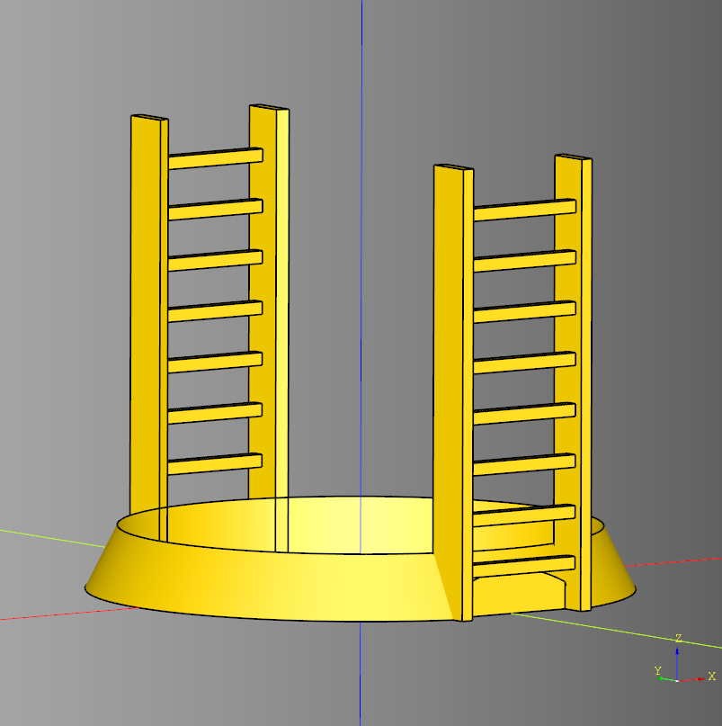

# cqindustry
Python library for making 3d printable Industrial terrain using cadquery.

[](./example/chiptower_readme_example.py)<br /><br />

``` python
import cadquery as cq
from cqindustry import ChipTower

bp_tower = ChipTower()
bp_tower.stories = 3
bp_tower.story_height = 75

bp_platform = bp_tower.bp_platform
bp_platform.render_floor = True

bp_tower.make()
tower_ex = bp_tower.build()

show_object(tower_ex)
```

* [Example](./example/chiptower_readme_example.py)
* [stl](./stl/chip_readme_example.stl)

---

## Project Documention
* [Documentation](documentation/documentation.md)
	* [Barrier](documentation/barrier.md)
	* [Can](documentation/can.md)
	* [chip](documentation/chip.md)
	* [walkway](documentation/walkway.md)

## Changes
* [Changelog](./changes.md)

## Dependencies
* [CadQuery 2.x](https://github.com/CadQuery/cadquery)
* [cqterrain](https://github.com/medicationforall/cqterrain)

## Projects
* [Chip Tower](https://miniforall.com/chiptower) 
* [Walkway Terrain](https://miniforall.com/walkways)
* [Jersey Barrier Set](https://miniforall.com/jerseybarriers)

---

### Installation
To install cqindustry directly from GitHub, run the following `pip` command:

	pip install git+https://github.com/medicationforall/cqindustry

**OR**

### Local Installation
From the cloned cqindustry directory run.

	pip install ./

---

## Running Example Scripts
[example_runner.py](example_runner.py) runs all examples.

``` bash
C:\Users\<user>\home\3d\cqindustry>python example_runner.py
```

**OR**

### Running individual examples
* From the root of the project run one of the example scripts:
  
``` bash
C:\Users\<user>\home\3d\cqindustry>python ./example/ring.py
```
