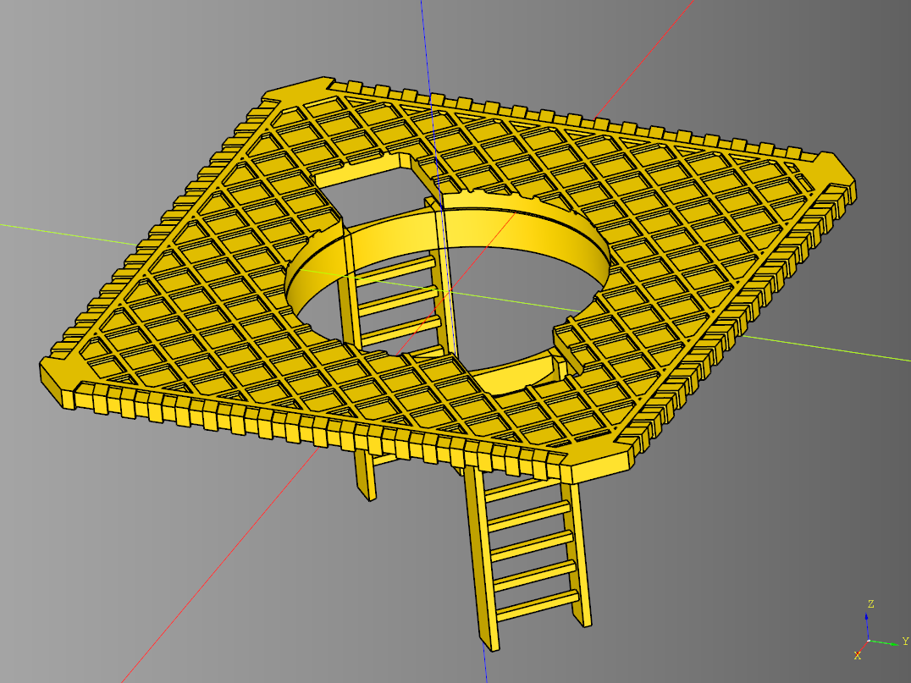
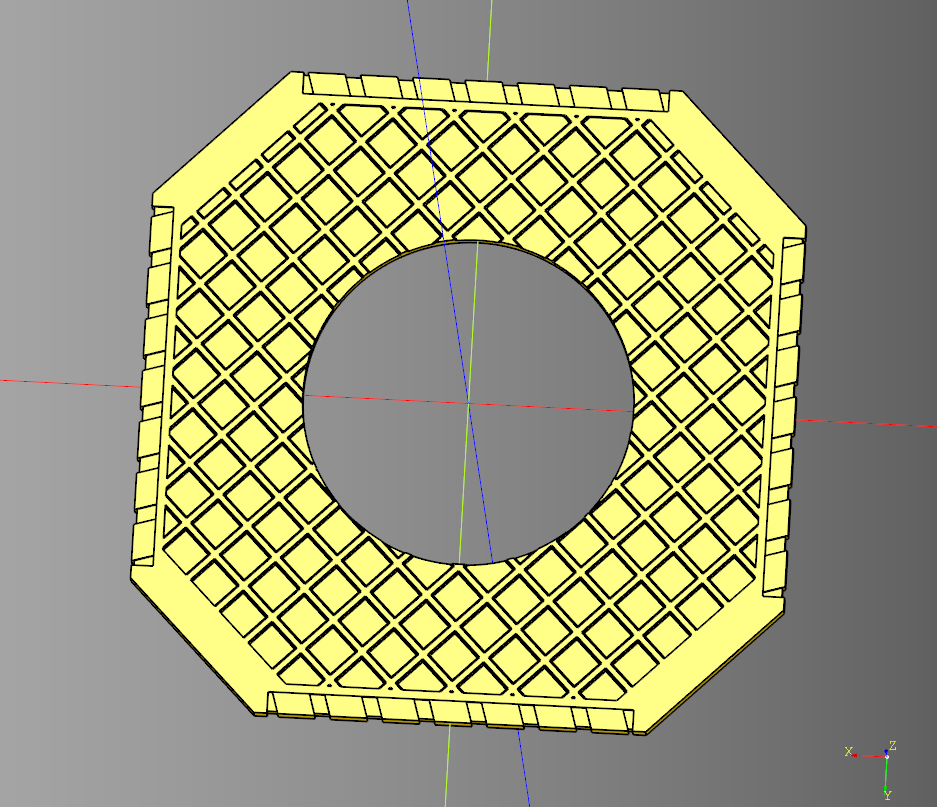
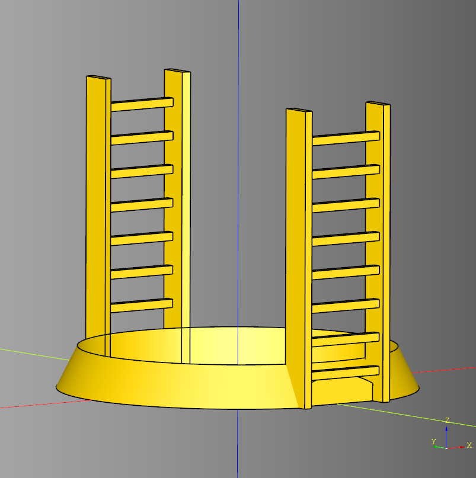
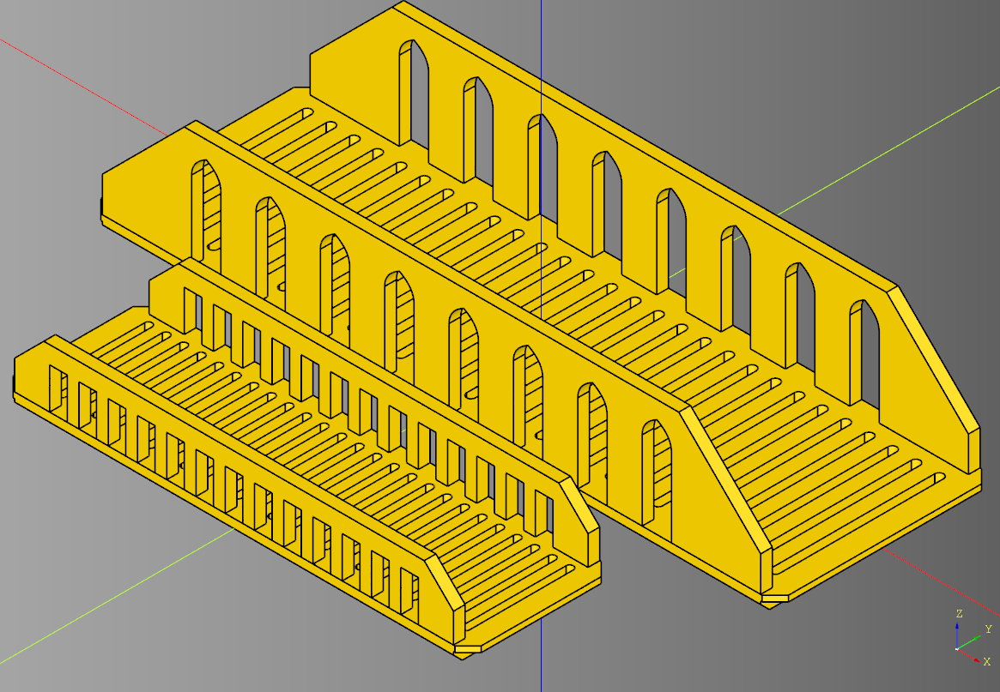
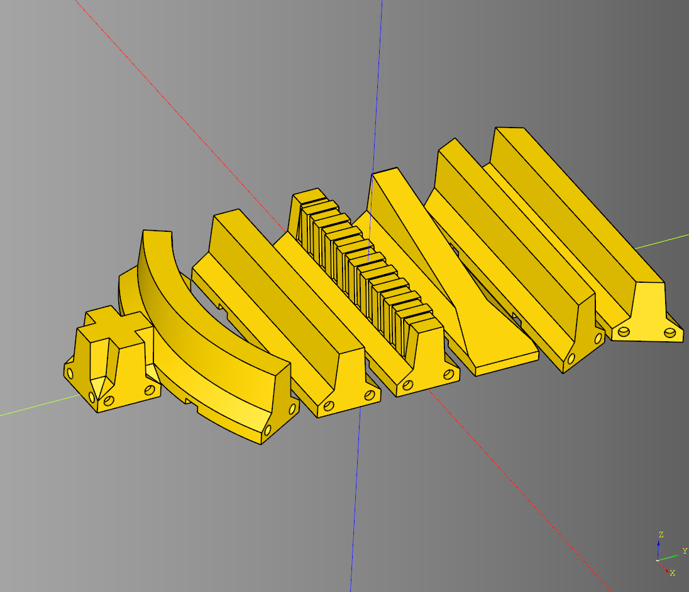

# cqindustry
python Library for making Industrial terrain.

  

## Platform
 

* [Code](./src/cqindustry/Platform.py)
* [Example](./example/platformExample.py)
* [Stl](.stl/platform_alt.stl)

# Ring
 

* [Code](./src/cqindustry/Ring.py)
* [Example](./example/ring.py)
* [Stl](.stl/ring.stl)

## Walkway
 

* [Code](./src/cqindustry/Walkway.py)
* [Example](./example/walkway.py)
* [Stl](.stl/walkway.stl)

## Jersey Barriers

* [Code](./src/cqindustry/Barrier.py)
* [Example](./example/barrier_greebled.py)
* [Stl](.stl/barrier_detailed.stl)

## Dependencies
* [CadQuery 2.x](https://github.com/CadQuery/cadquery)
* [cqterrain](https://github.com/medicationforall/cqterrain)

## Projects
* [Chip Tower](https://miniforall.com/chiptower) 
* [Walkway Terrain](https://miniforall.com/walkways)
* [Jersey Barrier Set](https://miniforall.com/jerseybarriers)

### Installation
To install cqindustry directly from GitHub, run the following `pip` command:

	pip install git+https://github.com/medicationforall/cqindustry

**OR**

### Local Installation
From the cloned cqindustry directory run.

	pip install ./
