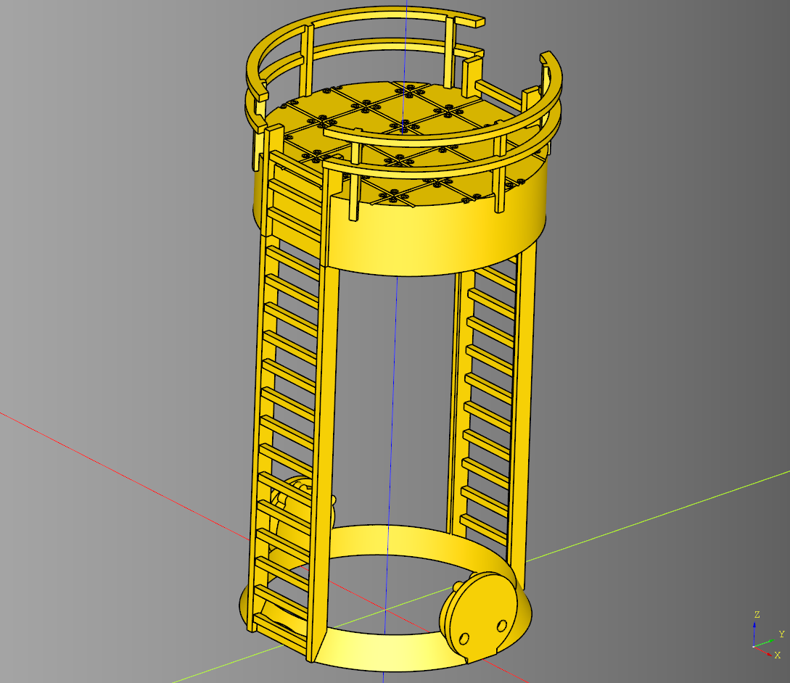
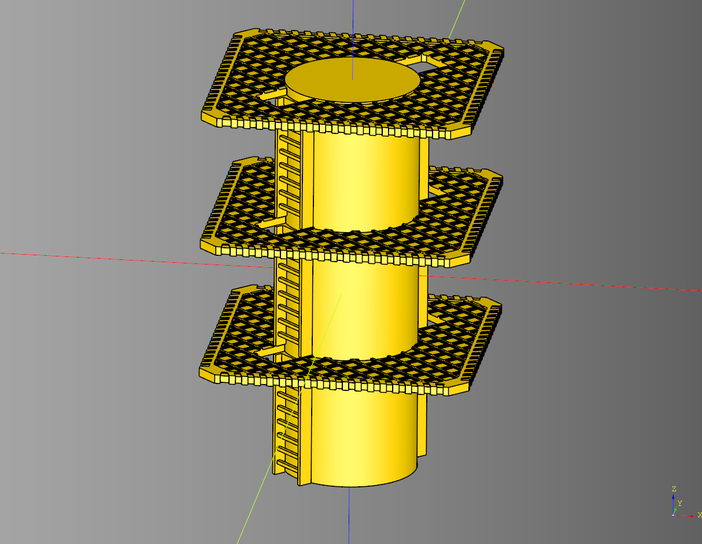

# cqindustry
Python library for making 3d printable Industrial terrain using cadquery.

---

[](documentation/can.md)<br /><br />

## Can Tower

``` python
import cadquery as cq
from cqindustry.can import CanTower

bp_can_tower = CanTower()
bp_can_tower.render_can = False
bp_can_tower.can_height = 122
bp_can_tower.can_diameter = 66
bp_can_tower.cut_padding = .5
bp_can_tower.ring_width = 4.5
bp_can_tower.platform_height = 20
bp_can_tower.platform_ladder_extends = 10
bp_can_tower.make()
can_tower = bp_can_tower.build()

show_object(can_tower.translate((0,0,0)))
```

* [Example](./example/can/can_tower.py)
* [stl](./stl/can_tower.stl)

---

## Chip Tower

[](documentation/chip.md)<br /><br />

``` python
import cadquery as cq
from cqindustry import ChipTower

bp_tower = ChipTower()
bp_tower.stories = 3
bp_tower.story_height = 75

bp_platform = bp_tower.bp_platform
bp_platform.render_floor = True

bp_tower.make()
tower_ex = bp_tower.build()

show_object(tower_ex)
```

* [Example](./example/chip/chiptower_readme_example.py)
* [stl](./stl/chip_readme_example.stl)

---

## Dome

[](documentation/dome.md)<br /><br />

``` python
import cadquery as cq
from cqdome import Dome, greeble

#init greebles
vent_bp = greeble.VentHexagon()
door_bp = greeble.DoorHexagon()
door_bp.hinge_x_translate = -4.5

window_pen_bp = greeble.WindowFrame()
window_pen_bp.type="pentagon"
window_pen_bp.margin=.1
window_pen_bp.render_pane = False

window_hex_bp = greeble.WindowFrame()
window_hex_bp.type="hexagon"
window_hex_bp.render_pane = False

# make dome
bp = Dome()

#center
bp.greebles_bp.append(window_pen_bp)

#ring 1
bp.greebles_bp.append(vent_bp)
bp.greebles_bp.append(window_hex_bp)
bp.greebles_bp.append(window_hex_bp)
bp.greebles_bp.append(window_hex_bp)
bp.greebles_bp.append(window_hex_bp)

#ring2
bp.greebles_bp.append(window_pen_bp)
bp.greebles_bp.append(window_hex_bp)
bp.greebles_bp.append(window_pen_bp)
bp.greebles_bp.append(window_hex_bp)
bp.greebles_bp.append(window_pen_bp)
bp.greebles_bp.append(door_bp)
bp.greebles_bp.append(window_pen_bp)
bp.greebles_bp.append(window_hex_bp)
bp.greebles_bp.append(window_pen_bp)
bp.greebles_bp.append(door_bp)

bp.render_greebles = True
bp.make()
dome = bp.build()

show_object(dome)
```

* [Example](./example/dome/dome.py)
* [stl](./stl/dome_complete.stl)

---

## Project Documention
* [Documentation](documentation/documentation.md)
	* [Can](documentation/can.md)
	* [Chip](documentation/chip.md)
	* [Dome](documentation/dome.md)


## Changes
* [Changelog](./changes.md)

## Dependencies
* [cqterrain](https://github.com/medicationforall/cqterrain)

---

## 3d Printed Projects
* [Chip Tower](https://miniforall.com/chiptower)
* [Dome Terrain](https://miniforall.com/dometerrain)

---

### Installation
To install cqindustry directly from GitHub, run the following `pip` command:

	pip install git+https://github.com/medicationforall/cqindustry

**OR**

### Local Installation
From the cloned cqindustry directory run.

	pip install ./

---

## Running Example Scripts
[example_runner.py](example_runner.py) runs all examples.

``` bash
C:\Users\<user>\home\3d\cqindustry>python example_runner.py
```

**OR**

### Running individual examples
* From the root of the project run one of the example scripts:
  
``` bash
C:\Users\<user>\home\3d\cqindustry>python ./example/ring.py
```
