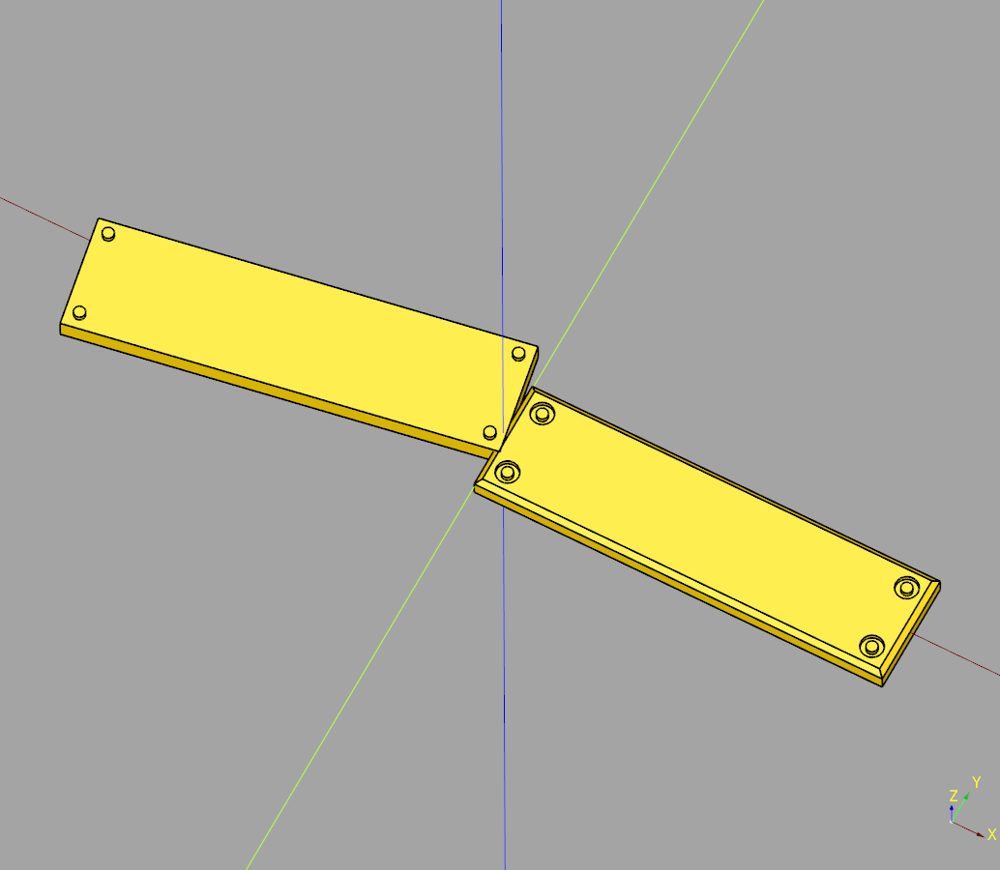
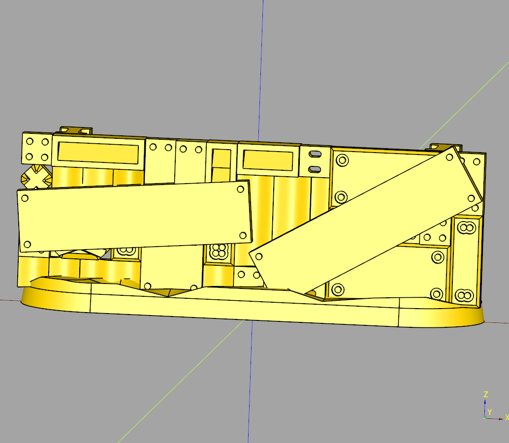
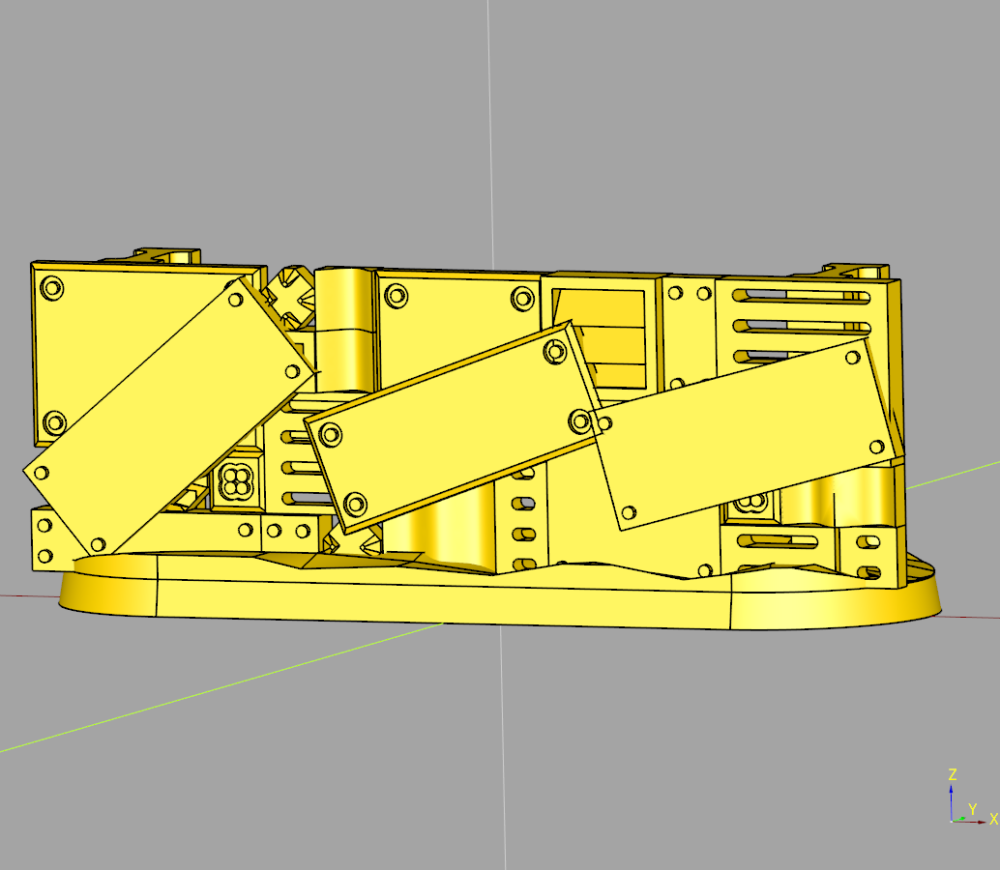
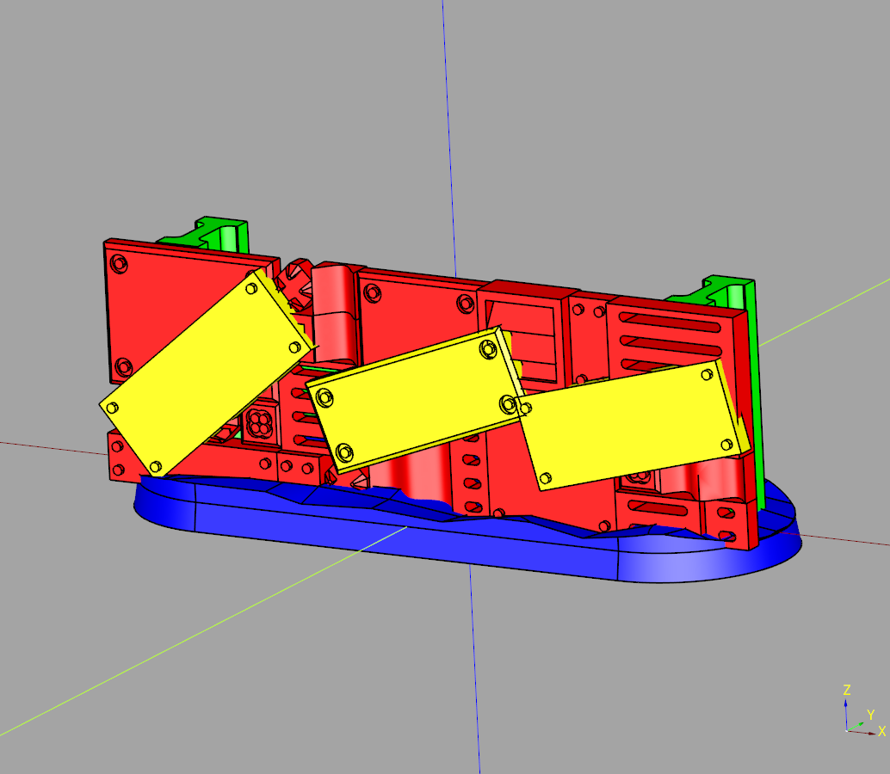

# cqindustry Barricade Documentation

---
## Index
* [Stylized](#stylized-panels)
* [Wall](#wall)
---

## Stylized Panels

### parameters
* length: float
* width: float
* height: float
* count: float
* seed: str 
* rotate: tuple[float,float,float]
* tiles: list[Callable[[float, float ,float],cq.Workplane]]

``` python
import cadquery as cq
from cqindustry.barricade import stylized_panels

result = stylized_panels(
    length = 75,
    width = 10,
    height=2,
    count=(2,3,1),
    seed = "seed",
    rotate = (-45,45,5)
    #tiles = [rivet,bolt_panel]
)

show_object(result)
```



* [source](../src/cqindustry/barricade/stylized_panels.py)
* [example](../example/barricade/stylized_panels.py)
* [stl](../stl/barricade_stylized_panels.stl)

## Wall

### parameters
* length: float
* width: float
* height: float
* seed: str
* base_height: float
* vertical_beam_count: int
* verical_beam_width: float
* beam_length: float
* beam_height: float
* web_thickness: float
* length_inset: float
* tiles: list[Callable[[float,float,float],cq.Workplane]]
* render_grid: bool
* grid_x_spacing: float
* grid_y_spacing: float
* grid_x_stretch: tuple[int,int,int]|int
* grid_y_stretch: tuple[int,int,int]|int
* grid_height: float|tuple[float,float,float]
* h_bleam_width: float
* h_beam_height: float
* render_panels: bool
* panel_seed: str|None
* panel_width: float
* panel_count: int|tuple[int,int,int]
* panel_rotate: float|tuple[float,float,float]
* panel_tiles: list[Callable[[float,float,float],cq.Workplane]]

``` python
import cadquery as cq
from cqindustry.barricade import Wall

from cqindustry.barricade.tiles import (
    plain,
    slot,
    rivet,
    vent,
    bolt_panel,
    corrugated,
    charge
)

bp_wall = Wall()

bp_wall.length:float = 75
bp_wall.width:float = 25
bp_wall.height:float = 60

bp_wall.seed = 'flay'
bp_wall.base_height = 3
bp_wall.vertical_beam_count = 2
bp_wall.verical_beam_width = 5

bp_wall.beam_length = 25
bp_wall.beam_height = 10
bp_wall.web_thickness = 2
bp_wall.length_inset = 15

bp_wall.tiles= [
    bolt_panel,
    bolt_panel,
    charge,
    rivet,
    rivet,
    slot,
    slot,
    vent, 
    corrugated,
    corrugated
]

bp_wall.render_grid = True
bp_wall.grid_x_spacing = 5
bp_wall.grid_y_spacing = 5
bp_wall.grid_x_stretch = (1,4,1)
bp_wall.grid_y_stretch = (1,3,1)
bp_wall.grid_height = (2,3,1)

bp_wall.h_bleam_width = 5
bp_wall.h_beam_height= 10

bp_wall.render_panels = True
bp_wall.panel_width = 10
bp_wall.panel_count = (2,4,1)
bp_wall.panel_rotate = (-45,60,5)
bp_wall.panel_tiles = [rivet,bolt_panel]
#bp_wall.panel_seed = 'test'

bp_wall.make()

ex_wall = bp_wall.build()

show_object(ex_wall)
```



### minimal example
``` python
import cadquery as cq
from cqindustry.barricade import Wall

bp_wall = Wall()

bp_wall.length:float = 75
bp_wall.width:float = 25
bp_wall.height:float = 60

bp_wall.seed = 'wyvern'
bp_wall.make()

ex_wall = bp_wall.build()

show_object(ex_wall)
```



### assembly example
``` python
import cadquery as cq
from cqindustry.barricade import Wall

bp_wall = Wall()

bp_wall.length:float = 75
bp_wall.width:float = 25
bp_wall.height:float = 60

bp_wall.seed = 'wyvern'

bp_wall.make()

ex_wall = bp_wall.build_assembly()

show_object(ex_wall)
``` 




* [source](../src/cqindustry/barricade/Wall.py)
* [example](../example/barricade/wall.py)
* [stl](../stl/barricade_wall.stl)
