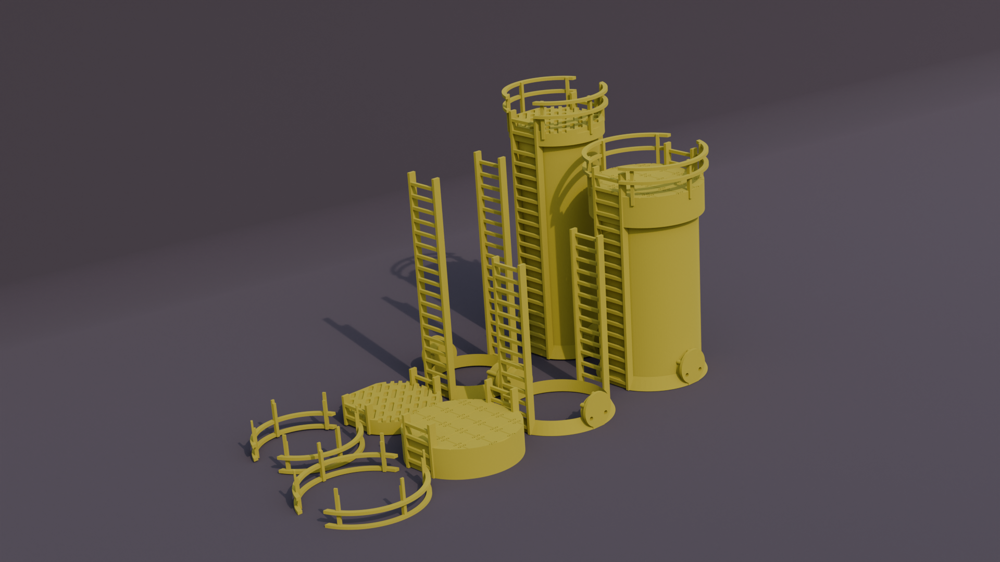
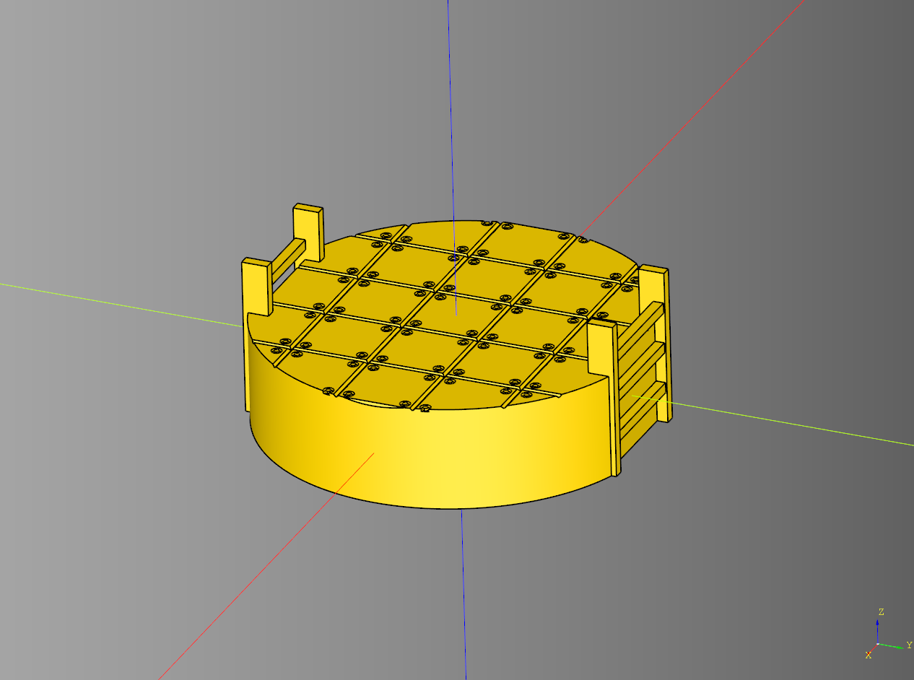
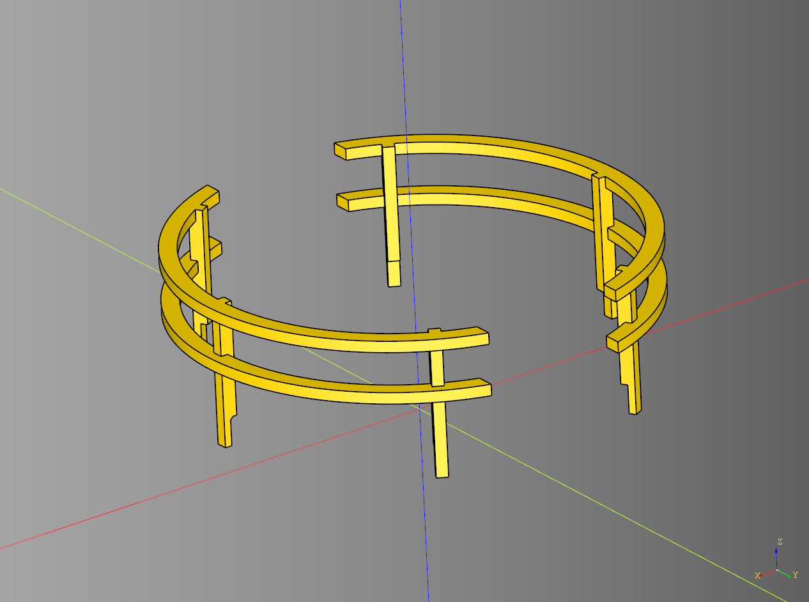
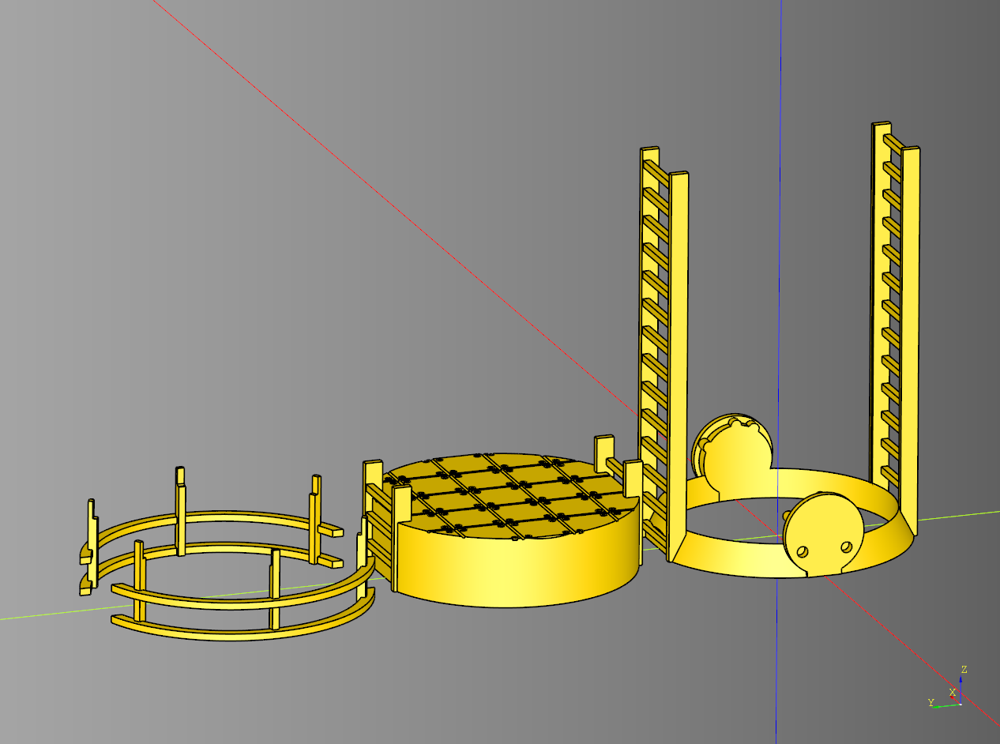

# cqindustry can Documentation

<br />

## Can Platform

### parameters
* height: float
* diameter: float
* cut_height: float
* render_floor: bool
* tile_length: float
* tile_width: float
* tile_height: float
* tile_method: Callable[[float,float,float],cq.Workplane]
* ladder_length: float
* ladder_width: float
* ladder_height: float
* ladder_cut_padding: float
* ladder_cut_chamfer: float

### blueprints
self.bp_ladder: [Ladder](https://github.com/medicationforall/cqterrain/blob/main/documentation/misc.md#ladder)

``` python
import cadquery as cq
from cqindustry.can import CanPlatform
from cqterrain import tile

bp_can_top = CanPlatform()
bp_can_top.height = 20
bp_can_top.diameter = 75
bp_can_top.cut_diameter = 66.5
bp_can_top.cut_height = 10

bp_can_top.render_floor = True
bp_can_top.tile_length = 15
bp_can_top.tile_width = 15
bp_can_top.tile_height = 3

bp_can_top.ladder_length = 25
bp_can_top.ladder_width = 5
bp_can_top.ladder_height = 30
bp_can_top.ladder_cut_padding = 1
bp_can_top.ladder_cut_chamfer = 2

bp_can_top.tile_method = tile.bolt_panel
bp_can_top.make()
platform = bp_can_top.build()

show_object(platform)
```




* [source](../src/cqindustry/can/CanPlatform.py)
* [example](../example/can/can_platform.py)
* [stl](../stl/can_platform.stl)

---

## Can Rail
Can set a [CanPlatform](#can-platform) as the parent.

### parameters
* parent: [CanPlatform](#can-platform)|None
* height: float
* rail_width: float
* rail_height: float
* support_count: int
* support_length: float
* support_width: float
* support_height: float

``` python
import cadquery as cq
from cqindustry.can import CanPlatform, CanRail

bp_platform = CanPlatform()
bp_platform.make()

platform = bp_platform.build()

bp_rail = CanRail()
bp_rail.make(bp_platform)
rail = bp_rail.build()

show_object(rail)
```



* [source](../src/cqindustry/can/CanRail.py)
* [example](../example/can/can_rail.py)
* [stl](../stl/can_rail.stl)

---

## Can Tower
Orchestrator class for building Can Tower Kits.

### parameters
* render_can: bool
* can_height: float
* can_diameter: float
* cut_padding: float
* ring_width: float
* platform_height: float
* platform_ladder_extends: float
* pipe_length: float

### blueprints
* bp_ring: [Ring](./chip.md#ring)
* bp_ring.height: float
* bp_ring.ladder_width: float
* bp_can: [ChipCan](./chip.md#chipcan)
* bp_chip_cut: [ChipCan](./chip.md#chipcan)
* bp_platform: [CanPlatform](#can-platform)
* bp_rail: [CanRail](#can-rail)


### build

``` python
import cadquery as cq
from cqindustry.can import CanTower

bp_can_tower = CanTower()
bp_can_tower.render_can = False
bp_can_tower.can_height = 122
bp_can_tower.can_diameter = 66
bp_can_tower.cut_padding = .5
bp_can_tower.ring_width = 4.5
bp_can_tower.platform_height = 20
bp_can_tower.platform_ladder_extends = 10
bp_can_tower.pipe_length = 75
bp_can_tower.make()
can_tower = bp_can_tower.build()

show_object(can_tower)
```

<br />

### build plate

``` python
import cadquery as cq
from cqindustry.can import CanTower

bp_can_tower = CanTower()
bp_can_tower.render_can = False
bp_can_tower.can_height = 122
bp_can_tower.can_diameter = 66
bp_can_tower.cut_padding = .5
bp_can_tower.ring_width = 4.5
bp_can_tower.platform_height = 20
bp_can_tower.platform_ladder_extends = 10
bp_can_tower.make()
can_tower = bp_can_tower.build_plate()

show_object(can_tower)
```

<br />


* [source](../src/cqindustry/can/CanTower.py)
* [example](../example/can/can_tower.py)
* [stl](../stl/can_tower.stl)
* [stl](../stl/can_tower_plate.stl)

---