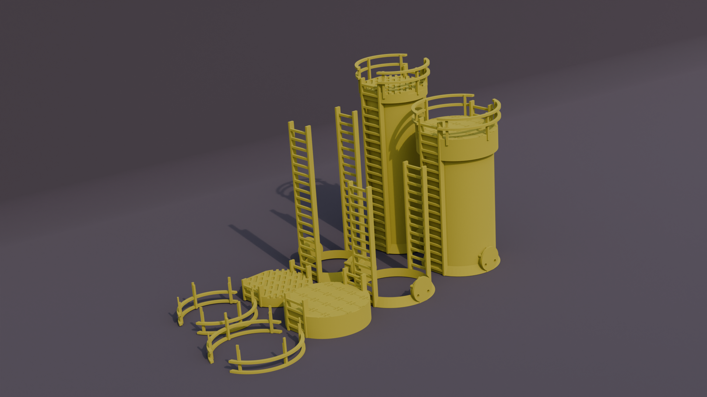
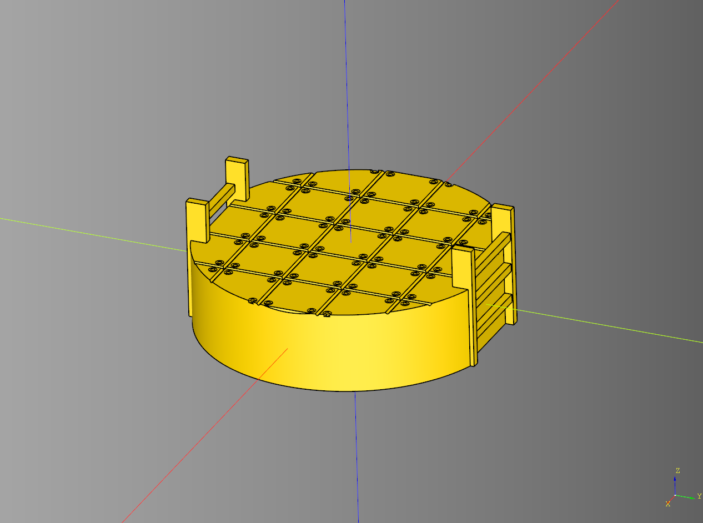
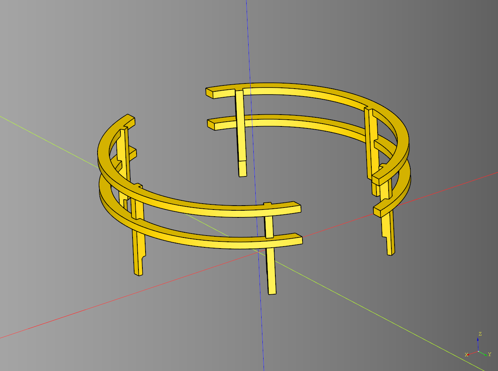
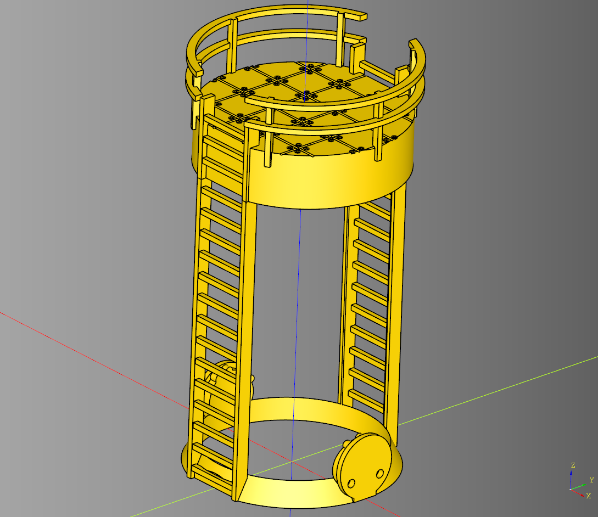
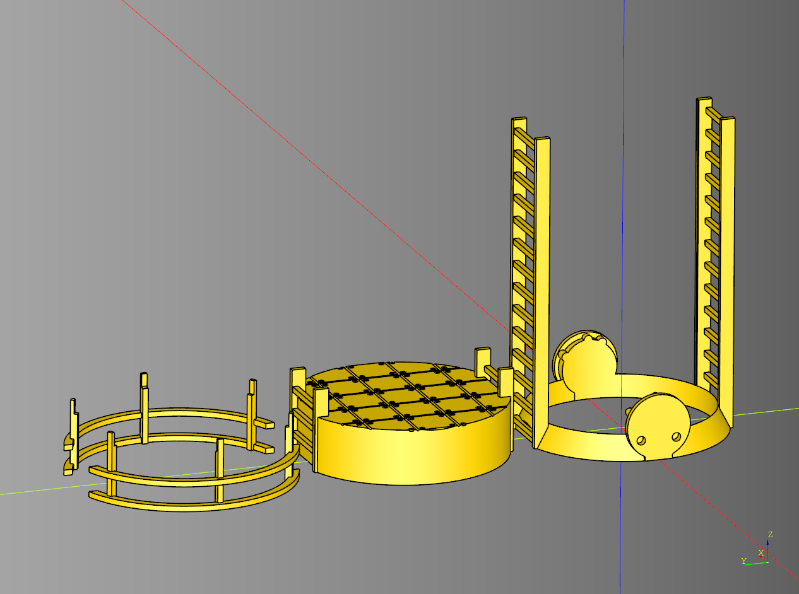
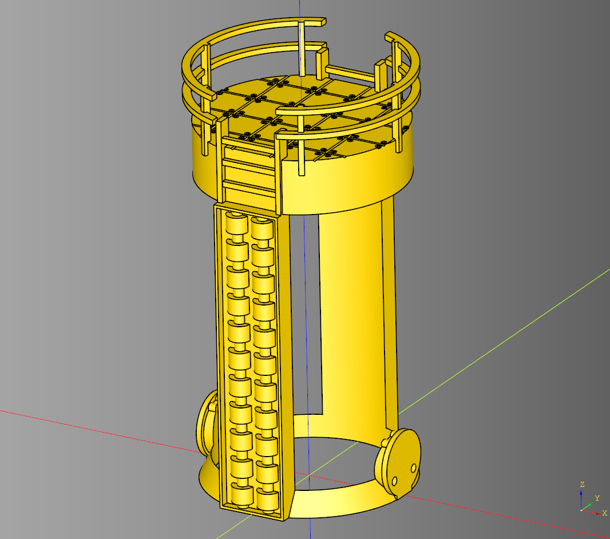
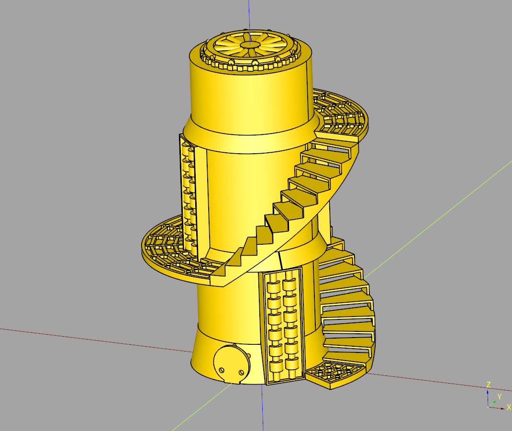
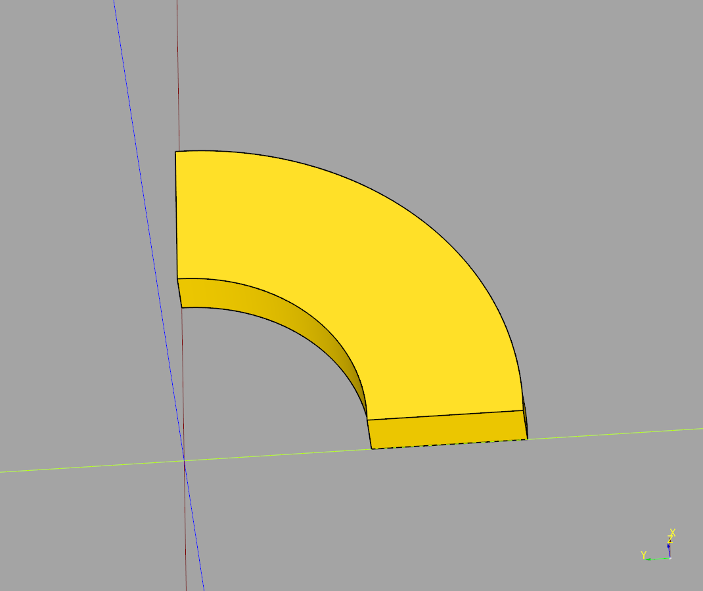
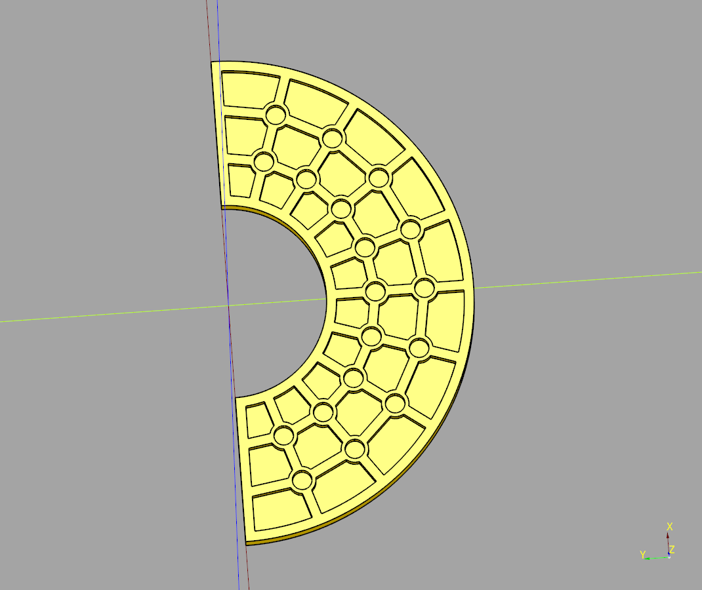
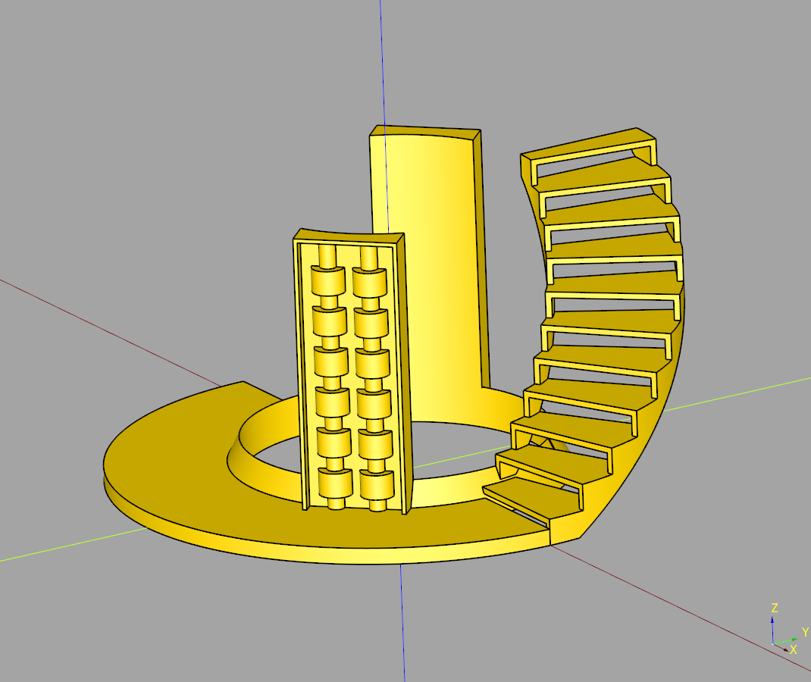

# cqindustry can Documentation

<br />

---
## Index
* [Can Platform](#can-platform)
* [Can Rail](#can-rail)
* [Can Tower](#can-tower)
* [Can Tower Stairs](#can-tower-stairs)
* [Round Platform](#round-platform)
* [Round Platform Greebled Circles](#round-platform-greebled-circles)
* [Stair Segment](#stair-segment)
---

## Can Platform

### parameters
* height: float
* diameter: float
* cut_height: float
* render_floor: bool
* tile_length: float
* tile_width: float
* tile_height: float
* tile_method: Callable[[float,float,float],cq.Workplane]
* ladder_length: float
* ladder_width: float
* ladder_height: float
* ladder_cut_padding: float
* ladder_cut_chamfer: float

### blueprints
self.bp_ladder: [Ladder](https://github.com/medicationforall/cqterrain/blob/main/documentation/misc.md#ladder)

``` python
import cadquery as cq
from cqindustry.can import CanPlatform
from cqterrain import tile

bp_can_top = CanPlatform()
bp_can_top.height = 20
bp_can_top.diameter = 75
bp_can_top.cut_diameter = 66.5
bp_can_top.cut_height = 10

bp_can_top.render_floor = True
bp_can_top.tile_length = 15
bp_can_top.tile_width = 15
bp_can_top.tile_height = 3

bp_can_top.ladder_length = 25
bp_can_top.ladder_width = 5
bp_can_top.ladder_height = 30
bp_can_top.ladder_cut_padding = 1
bp_can_top.ladder_cut_chamfer = 2

bp_can_top.tile_method = tile.bolt_panel
bp_can_top.make()
platform = bp_can_top.build()

show_object(platform)
```




* [source](../src/cqindustry/can/CanPlatform.py)
* [example](../example/can/can_platform.py)
* [stl](../stl/can_platform.stl)

---

## Can Rail
Can set a [CanPlatform](#can-platform) as the parent.

### parameters
* parent: [CanPlatform](#can-platform)|None
* height: float
* rail_width: float
* rail_height: float
* support_count: int
* support_length: float
* support_width: float
* support_height: float

``` python
import cadquery as cq
from cqindustry.can import CanPlatform, CanRail

bp_platform = CanPlatform()
bp_platform.make()

platform = bp_platform.build()

bp_rail = CanRail()
bp_rail.make(bp_platform)
rail = bp_rail.build()

show_object(rail)
```



* [source](../src/cqindustry/can/CanRail.py)
* [example](../example/can/can_rail.py)
* [stl](../stl/can_rail.stl)

---

## Can Tower
Orchestrator class for building Can Tower Kits.

### parameters
* render_can: bool
* render_pipe: bool
* render_rails: bool
* render_platform: bool
* render_ring: bool
* can_height: float
* can_diameter: float
* cut_padding: float
* ring_width: float
* platform_height: float
* platform_ladder_extends: float
* pipe_length: float

### blueprints
* bp_ring: [Ring](./chip.md#ring)
* bp_ring.height: float
* bp_ring.ladder_width: float
* bp_can: [ChipCan](./chip.md#chipcan)
* bp_chip_cut: [ChipCan](./chip.md#chipcan)
* bp_platform: [CanPlatform](#can-platform)
* bp_rail: [CanRail](#can-rail)


### build

``` python
import cadquery as cq
from cqindustry.can import CanTower

bp_can_tower = CanTower()
bp_can_tower.render_can = False
bp_can_tower.render_pipe = True
bp_can_tower.render_rails = True
bp_can_tower.render_platform = True
bp_can_tower.render_ring = True
bp_can_tower.can_height = 122
bp_can_tower.can_diameter = 66
bp_can_tower.cut_padding = .5
bp_can_tower.ring_width = 4.5
bp_can_tower.platform_height = 20
bp_can_tower.platform_ladder_extends = 10
bp_can_tower.pipe_length = 75
bp_can_tower.make()
can_tower = bp_can_tower.build()

show_object(can_tower)
```

<br />

### build plate

``` python
import cadquery as cq
from cqindustry.can import CanTower

bp_can_tower = CanTower()
bp_can_tower.render_can = False
bp_can_tower.can_height = 122
bp_can_tower.can_diameter = 66
bp_can_tower.cut_padding = .5
bp_can_tower.ring_width = 4.5
bp_can_tower.platform_height = 20
bp_can_tower.platform_ladder_extends = 10
bp_can_tower.make()
can_tower = bp_can_tower.build_plate()

show_object(can_tower)
```

<br />


* [source](../src/cqindustry/can/CanTower.py)
* [example](../example/can/can_tower.py)
* [stl](../stl/can_tower.stl)
* [stl](../stl/can_tower_plate.stl)

#### Alternate Ring Declaration

``` python
import cadquery as cq
from cqindustry.can import CanTower
from cqindustry.chip import RingConduit

bp_can_tower = CanTower()
bp_can_tower.render_can = False
bp_can_tower.render_pipe = True
bp_can_tower.render_rails = True
bp_can_tower.render_platform = True
bp_can_tower.render_ring = True
bp_can_tower.can_height = 122
bp_can_tower.can_diameter = 66
bp_can_tower.cut_padding = .5
bp_can_tower.ring_width = 4.5
bp_can_tower.platform_height = 20
bp_can_tower.platform_ladder_extends = 10
bp_can_tower.pipe_length = 75

bp_can_tower.bp_ring = RingConduit()

bp_can_tower.make()
can_tower = bp_can_tower.build()

show_object(can_tower.translate((0,0,0)))
```

<br />

* [example](../example/can/can_tower_alt_ring.py)
* [stl](../stl/can_tower_alt_ring.stl)
* [stl](../stl/can_tower_alt_ring_plate.stl)

---

## Can Tower Stairs

### parameters
* diameter: float
* height: float
* render_can: bool
* render_pipe: bool

### blueprints
* bp_can:base|None = [ChipCan](./chip.md#chipcan)()
* bp_floor_one:base|None = [StairSegment](#stair-segment)()
* bp_floor_two:base|None = [StairSegment](#stair-segment)()
* bp_floor_three:base|None = [StairSegment](#stair-segment)()

``` python
import cadquery as cq
from cqindustry.can import CanTowerStairs

bp_tower = CanTowerStairs()

bp_tower.diameter = 73
bp_tower.height = 194

bp_tower.render_can = True
bp_tower.render_pipe = True
bp_tower.make()

ex_tower = bp_tower.build()

show_object(ex_tower)
```

<br />

* [source](../src/cqindustry/can/CanTowerStairs.py)
* [example](../example/can/can_tower_stairs.py)
* [stl](../stl/can_tower_stairs.stl)

---

## Round Platform

### parameters
* inner_diameter: float
* outer_diameter: float
* height: float
* angle: float

``` python
import cadquery as cq
from cqindustry.can import RoundPlatform

bp_platform = RoundPlatform()

bp_platform.inner_diameter = 30
bp_platform.outer_diameter = 55
bp_platform.height = 4
bp_platform.angle = 90

bp_platform.make()

ex_platform = bp_platform.build()

show_object(ex_platform)
```

<br />

* [source](../src/cqindustry/can/RoundPlatform.py)
* [example](../example/can/round_platform.py)
* [stl](../stl/can_round_platform.stl)

---

## Round Platform Greebled Circles

### parameters
* tile_height: float
* frame_width: float
* spacing: float
* taper: float|None
* rows: int
* offset: float
* circle_diameter: float
* cut_circle_diameter: float
* circle_max_index: float

``` python
import cadquery as cq
from cqindustry.can import RoundPlatformGreebledCircles

bp_platform = RoundPlatformGreebledCircles()

bp_platform.inner_diameter = 40
bp_platform.outer_diameter = 100
bp_platform.width = 25
bp_platform.height = 4
bp_platform.tile_height = 1
bp_platform.spacing = 10
bp_platform.rows = 11
bp_platform.taper = None
bp_platform.offset = -1
bp_platform.angle = 180
bp_platform.tile_height = 2
bp_platform.circle_diameter = 2.8
bp_platform.cut_circle_diameter = 2
bp_platform.circle_max_index = 1

bp_platform.make()

ex_platform = bp_platform.build()

show_object(ex_platform)
```

<br />

* [source](../src/cqindustry/can/RoundPlatformGreebledCircles.py)
* [example](../example/can/round_platform_greebled_circles.py)
* [stl](../stl/can_round_platform_greebled_stairs.stl)

---

## Stair Segment

### parameters
* diameter:float
* diameter_margin:float
* height:float
* render_can:bool
* render_stairs:bool
* render_ladder:bool
* stair_count:int
* ramp_width:float
* platform_height:float
* platform_angle:float
* ring_rotate:float
* ring_padding:float
* ring_height:float

### blueprints
* bp_can: Base|None = [ChipCan](./chip.md#chipcan)()
* bp_ring: Base|None = [Ring](./chip.md#ring)()
* bp_platform: Base|None = [RoundPlatform](#round-platform)()

``` python
import cadquery as cq
from cqindustry.can import StairSegment

bp_segment = StairSegment()

bp_segment.diameter = 73
bp_segment.diameter_margin = 0.5
bp_segment.height = 75 - 4

bp_segment.render_can = False
bp_segment.render_stairs = True
bp_segment.render_ladder = True
bp_segment.stair_count = 11
bp_segment.ramp_width = 64

bp_segment.platform_height = 4
bp_segment.platform_angle = 180

bp_segment.ring_rotate = -45
bp_segment.ring_padding = 10
bp_segment.ring_height = 10

#blueprints
#self.bp_can:Base|None = self.init_can()
#self.bp_ring:Base|None = self.init_ring()

bp_segment.make()

ex_segment = bp_segment.build()

show_object(ex_segment)
```

<br />

* [source](../src/cqindustry/can/StairSegment.py)
* [example](../example/can/stair_segment.py)
* [stl](../stl/can_stair_segment.stl)

---