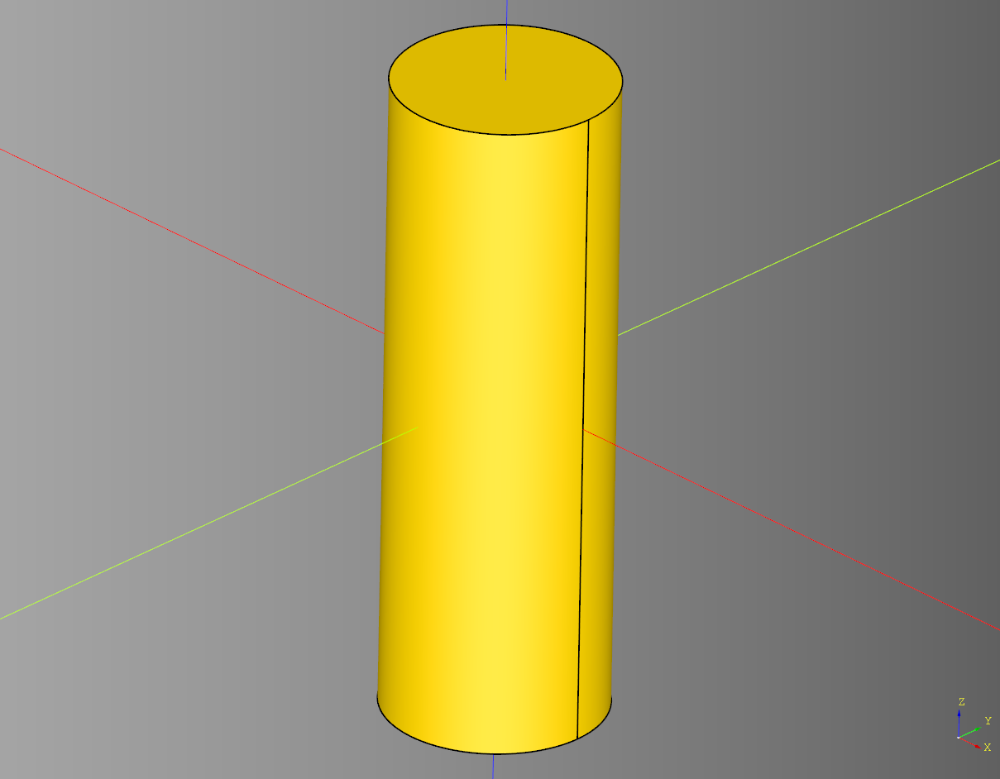
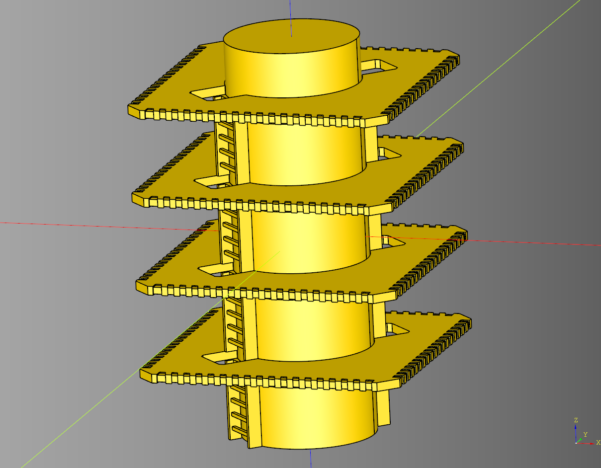
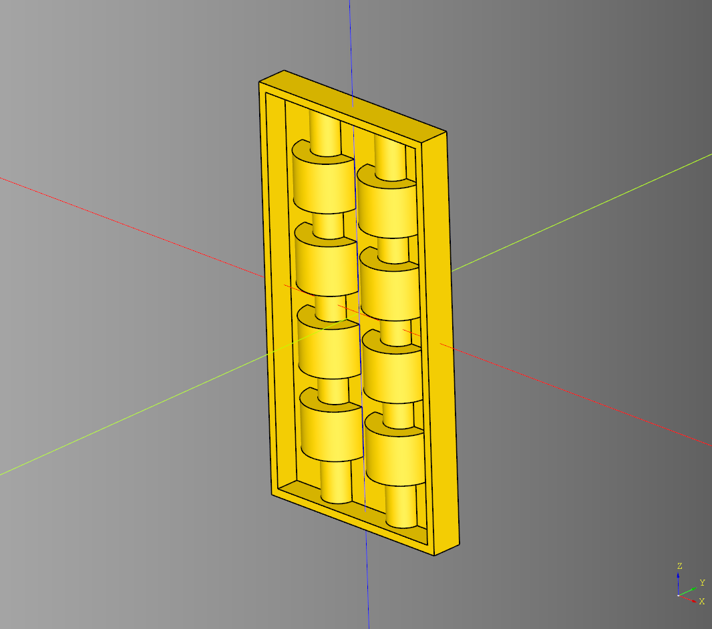
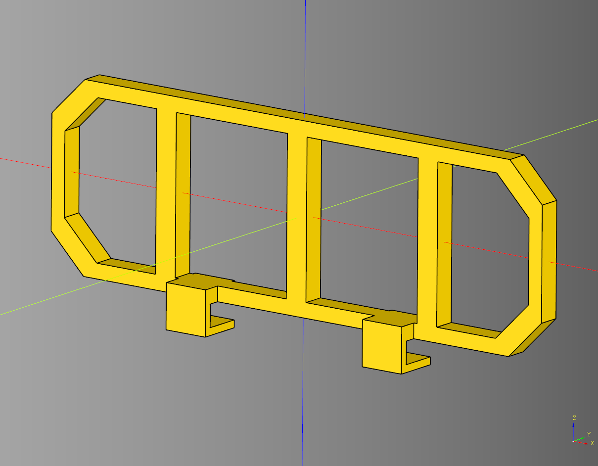
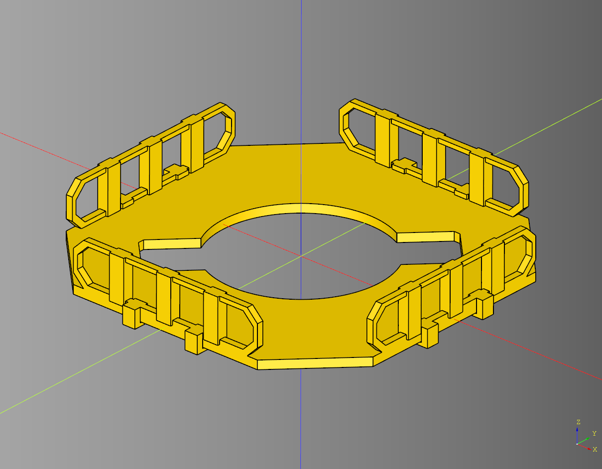
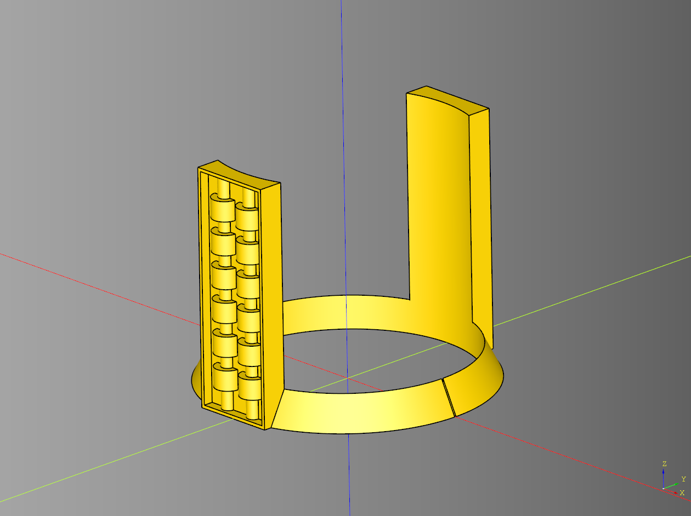

# cqindustry chip Documentation

## Index
* [ChipCan](#chipcan)
* [ChipTower](#chiptower)
* [Guard Rail](#guard-rail)
* [Make Guard Rails](#make-guard-rails)
* [Platform](#platform)
* [Ring](#ring)
* [Ring Conduit](#ring-conduit)

---

## ChipCan
### parameters
* height: float
* diameter: float
  
``` python
import cadquery as cq
from cqindustry import ChipCan

bp_can = ChipCan()
bp_can.height = 75 * 3
bp_can.diameter = 75
bp_can.make()

can_ex = bp_can.build()
```



* [source](../src/cqindustry/chip/ChipCan.py)
* [example](../example/chip/chip_can.py)
* [stl](../stl/chip_can.stl)

---


## ChipTower

### parameters
* length: float
* width: float
* height: float
* stories: int
* story_height: float
* can_diameter_padding: float
* render_can: bool
* ring_alternate_rotate: bool - if set to true every other ring will be rotated 90 degrees.
* render_story_proxy: bool
* render_platforms: bool
* render_rings: bool
* render_rail: bool

### blueprints
* bp_can: Base = ChipCan()
* bp_ring: Base = Ring()| Tuple - Can be a single blueprint instance or a tuple of blueprints that wil alternate between floors.
* bp_platform: Base = Platform()
* bp_rail: Base = GuardRail()

``` python
import cadquery as cq
from cqindustry import ChipTower

bp_tower = ChipTower()
#bp_tower.width = 230
bp_tower.stories = 4
bp_tower.story_height = 50
bp_tower.render_story_proxy = False

bp_platform = bp_tower.bp_platform
bp_platform.render_floor = False

bp_tower.make()
tower_ex = bp_tower.build()
```



* [source](../src/cqindustry/chip/ChipTower.py)
* [example](../example/chip/chip_tower_set.py)
* [stl](../stl/chip_tower_set.stl)
  
---

## Conduit

### parameters
* frame:float = 1
* frame_depth:float = 3
* pipe_count:int = 2
* pipe_radius:float = 4
* pipe_inner_radius:float = 2
* segment_length:float = 6
* space:float = 4
* pipe_padding:float = 1

``` python
import cadquery as cq
from cqindustry.chip import Conduit

bp_conduit = Conduit()
bp_conduit.frame = 1
bp_conduit.frame_depth = 3
bp_conduit.pipe_count = 2
bp_conduit.pipe_radius = 4
bp_conduit.pipe_inner_radius = 2
bp_conduit.segment_length = 6
bp_conduit.space = 4
bp_conduit.pipe_padding = 1
bp_conduit.make()
ex_conduit = bp_conduit.build()

show_object(ex_conduit)
```



* [source](../src/cqindustry/chip/Conduit.py)
* [example](../example/chip/conduit.py)
* [stl](../stl/chip_conduit_class.stl)

---


## Guard Rail

### parameters
* length: float
* width: float
* height: float
* corner_chamfer: float
* frame_padding: float
* render_posts: bool
* post_length: float
* post_width: float
* post_spacing: float
* render_clamps: bool
* clamp_length: float
* clamp_width: float
* clamp_height: float
* clamp_padding: float
* clamp_spacing: float
* clamp_cut_width: float
* clamp_cut_height: float
* clamp_cut_z_translate: float
* clamp_y_translate: float

``` python
import cadquery as cq
from cqindustry import GuardRail

bp_rail = GuardRail()

bp_rail.length = 75
bp_rail.width = 3
bp_rail.height = 25
bp_rail.corner_chamfer = 5
bp_rail.frame_padding = 4

bp_rail.render_posts = True
bp_rail.post_length = 3
bp_rail.post_width = 3
bp_rail.post_spacing = 20

bp_rail.render_clamps = True
bp_rail.clamp_length = 6
bp_rail.clamp_width = 6
bp_rail.clamp_height = 6
bp_rail.clamp_padding = 2
bp_rail.clamp_spacing = 30
bp_rail.clamp_cut_width = 1
bp_rail.clamp_cut_height = 3
bp_rail.clamp_cut_z_translate = 0.5
bp_rail.clamp_y_translate = -1

bp_rail.make()
test_rail = bp_rail.build()
```



* [source](../src/cqindustry/chip/GuardRail.py)
* [example](../example/chip/guard_rail.py)
* [stl](../stl/guard_rail.stl)
* 
---


## Make Guard Rails
Helper function to make guard rails around a platform

### parameters
* bp_platform
* bp_guard_rail
* length_spacing: float 
* width_spacing: float

### returns
* tuple[cq.Workplane, cq.Workplane, cq.Workplane]

``` python
import cadquery as cq
from cqindustry.chip import GuardRail, Platform, make_platform_rails

bp_platform = Platform()
bp_platform.length = 150
bp_platform.width = 150
bp_platform.stripe_width = 5
bp_platform.corner_chamfer = 30
bp_platform.height = 4
bp_platform.bar_width = 10
bp_platform.render_stripes = False
bp_platform.stripe_padding = .3
bp_platform.render_center_cut = True
bp_platform.render_floor = False 
bp_platform.make()
platform = bp_platform.build()

bp_rail = GuardRail()
bp_rail.width = 3
bp_rail.height = 20
bp_rail.frame_padding = 4
bp_rail.render_posts = True
bp_rail.post_length = 7
bp_rail.post_width = 5
bp_rail.post_spacing = 23
bp_rail.render_clamps = True
bp_rail.clamp_length = 6
bp_rail.clamp_width = 7
bp_rail.clamp_height = 8
bp_rail.clamp_cut_width = 3
bp_rail.clamp_cut_height = 3.5
bp_rail.clamp_cut_z_translate = .25
bp_rail.make()

rails, rail_length, rail_width = make_platform_rails(bp_platform, bp_rail, 23+7.5, 23+7.5)

scene = (
    cq.Workplane("XY")
    .union(platform)
    .union(rails)
)

show_object(scene)
```



* [source](../src/cqindustry/chip/make_platform_rails.py)
* [example](../example/chip/guard_rail_platform.py)
* [stl](../stl/guard_rail_platform.stl)


---


## Platform

### parameters
* length: float
* width: float
* height: float
* corner_chamfer: float
* render_center_cut: bool
* cut_diameter: float
* render_stripes: bool
* stripe_width: float
* stripe_side_padding: float
* stripe_padding: float
* bar_width: float
* bar_inset: float
* bar_padding: float
* render_floor: bool
* floor_height: float
* floor_tile_size: float
* floor_tile_padding: float
* floor_pading: float
* render_ladders: bool
* ladder_length: float
* ladder_width: float | None
* ladder_cut_chamfer: float

``` python
import cadquery as cq
from cqindustry import Platform

bp = Platform()
bp.length = 150
bp.stripe_width = 5
bp.corner_chamfer = 30
bp.height = 4
bp.bar_width = 10
bp.render_stripes = True
bp.stripe_padding = .3
bp.make()
platform = bp.build()
```


* [source](../src/cqindustry/chip/Platform.py)
* [example](../example/chip/platformExample.py)
* [stl](../stl/platform_alt.stl)

---


## Ring

### parameters
* cut_diameter: float
* diameter: float
* inset: float
* height: float
* render_ladders: bool
* ladder_height: float
* ladder_length: float
* ladder_width: float
* ladder_cut_padding: float
* ladder_cut_chamfer: float

``` python
import cadquery as cq
from cqindustry import Ring

bp_ring = Ring()
bp_ring.cut_diameter = 76
bp_ring.diameter = bp_ring.cut_diameter + 10
bp_ring.inset = 5
bp_ring.height = 10
bp_ring.render_ladders = True
bp_ring.ladder_height = 71
bp_ring.ladder_length = 25
bp_ring.ladder_width = 10
bp_ring.ladder_cut_padding = 1.5
bp_ring.ladder_cut_chamfer = 2
bp_ring.make()
ring = bp_ring.build()
```


* [source](../src/cqindustry/chip/Ring.py)
* [example](../example/chip/ring.py)
* [stl](../stl/ring.stl)

---


## Ring Conduit
Extends Ring class

### parameters

### Inherited from Ring
* cut_diameter: float
* diameter: float
* inset: float
* height: float
* render_ladders: bool
* ladder_height: float
* ladder_length: float
* ladder_width: float
* ladder_cut_padding: float
* ladder_cut_chamfer: float

### Tile Conduit parameters
* frame: float
* frame_depth: float
* pipe_count: int|None
* pipe_radius: float
* pipe_inner_radius: float
* segment_length: float
* space: float = 4
* pipe_padding: float

``` python
import cadquery as cq
from cqindustry import RingConduit

bp_ring = RingConduit()
bp_ring.cut_diameter = 76
bp_ring.diameter = bp_ring.cut_diameter + 10
bp_ring.inset = 5
bp_ring.height = 10
bp_ring.render_ladders = True
bp_ring.ladder_height = 71
bp_ring.ladder_length = 25
bp_ring.ladder_width = 10

bp_ring.frame = 1
bp_ring.frame_depth = 3
bp_ring.pipe_count = None
bp_ring.pipe_radius = 4
bp_ring.pipe_inner_radius = 2
bp_ring.segment_length = 6
bp_ring.space = 4
bp_ring.pipe_padding = 1

bp_ring.make()
ring = bp_ring.build()
```



* [source](../src/cqindustry/chip/RingConduit.py)
* [example](../example/chip/ring_conduit.py)
* [stl](../stl/ring_conduit.stl)

---