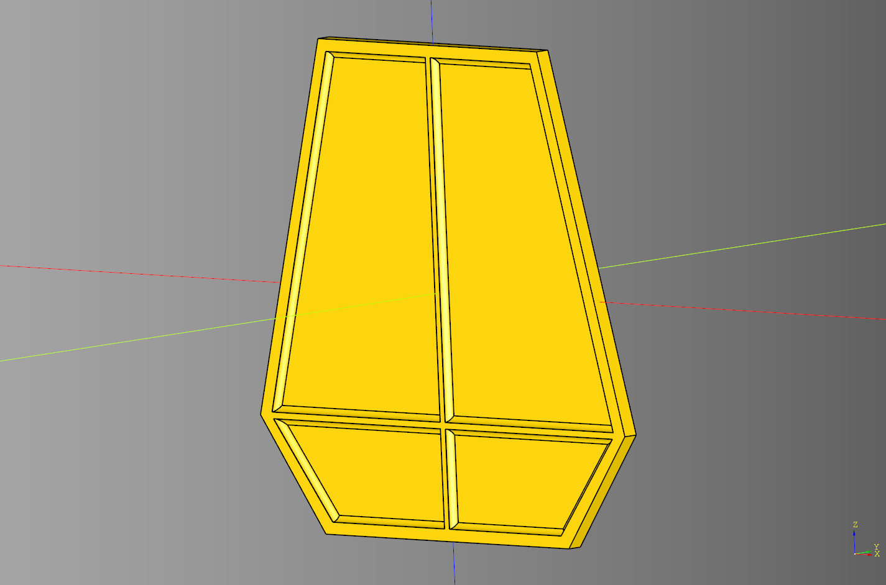
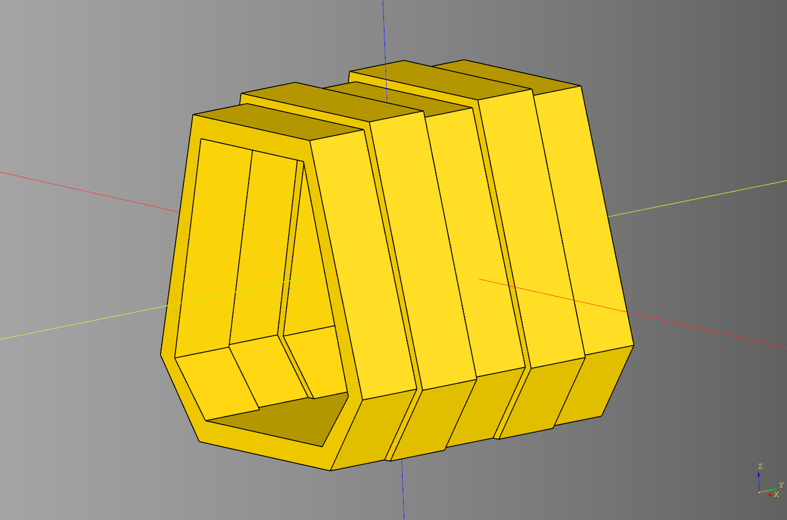
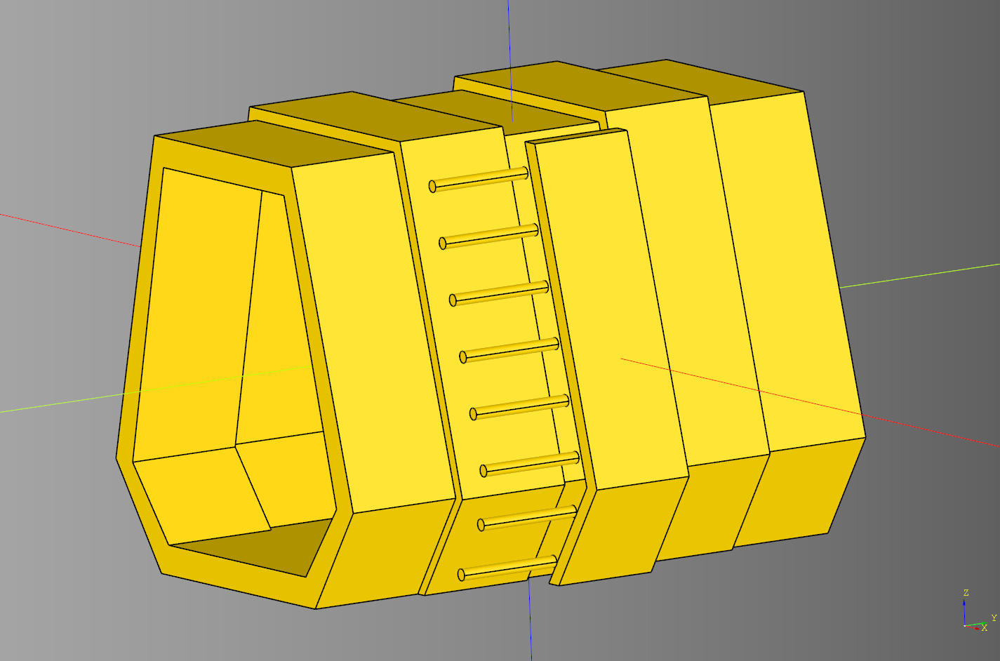
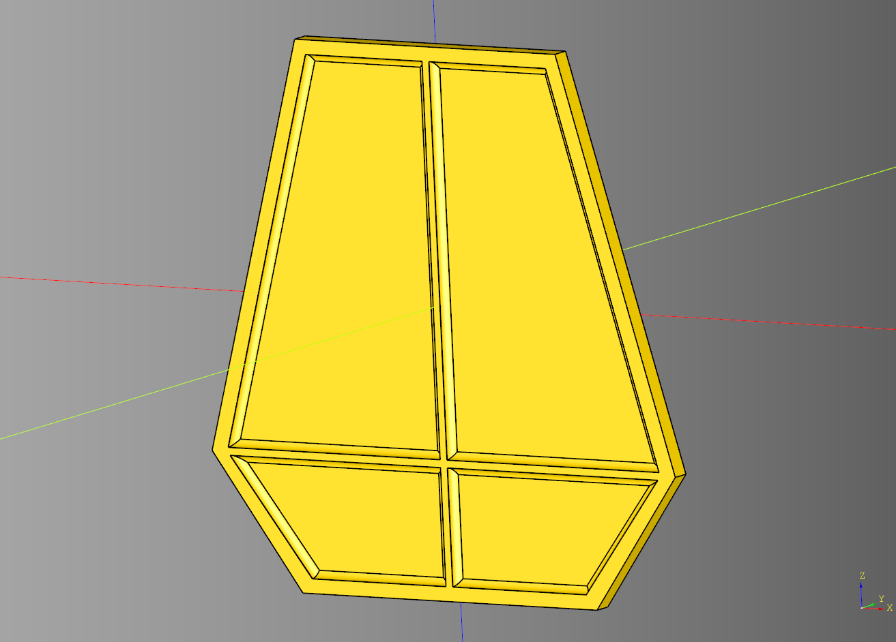
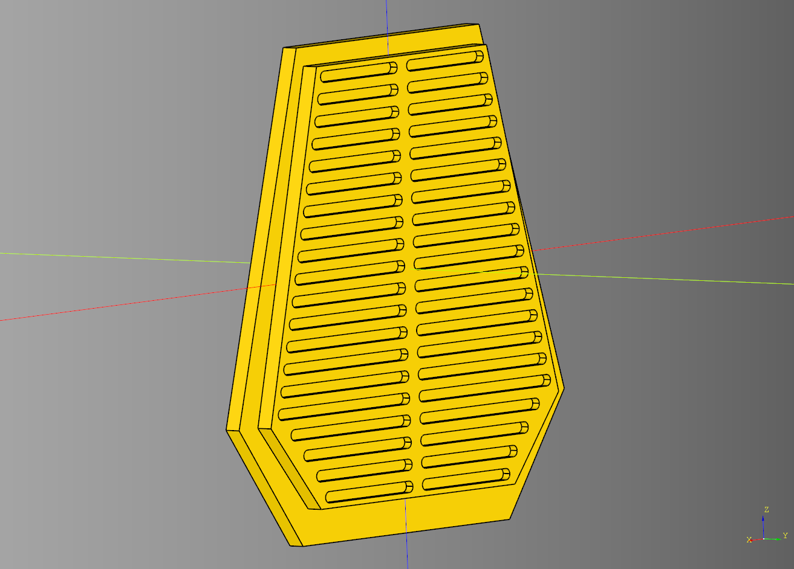
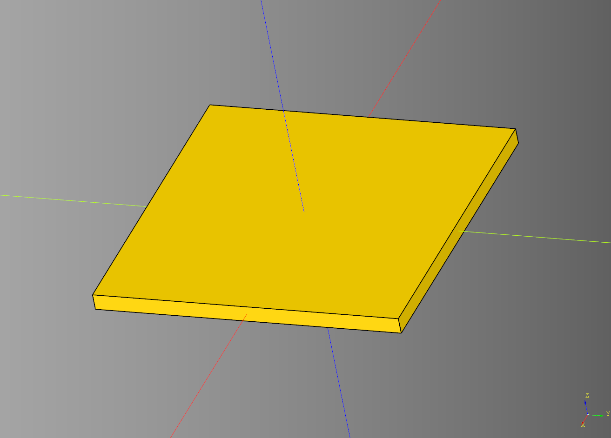
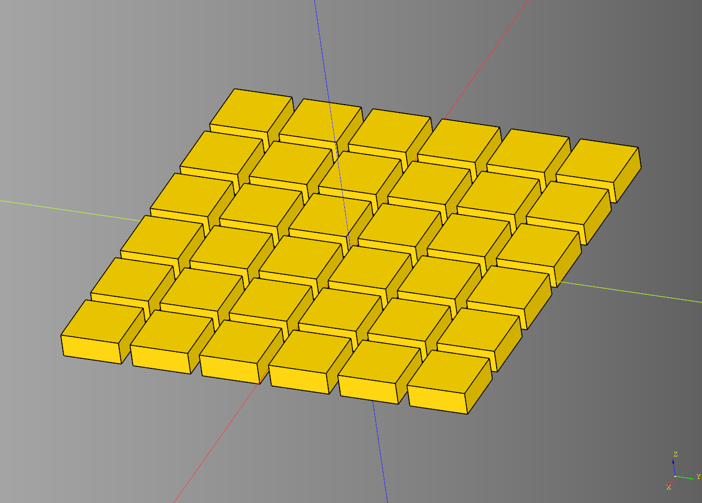

# Container Documentation

What if we took a portal and made it long? This is that.

---
## Container

Orchestration class for assembling a container. Inherits from [Portal](./portal.md#portal)

### parameters
* render_floor: bool
* render_ladder:bool

### blueprints
* bp_frame = [ContainerFrame](#container-frame)()
* bp_ramp = [ContainerRamp](#container-ramp)()
* bp_ladder = [ContainerLadder](#container-ladder)()
* bp_floor = Floor()

```python
import cadquery as cq
from cqindustry.container import Container

bp_container = Container()
bp_container.bp_hinge.rotate_deg = -90

bp_container.make()

result = bp_container.build()
show_object(result)
```


* [source](../src/cqindustry/container/Container.py)
* [example](../example/container/container.py)
* [stl](../stl/container.stl)

---
## Container Door

Inherits from [BaseCoffin](./portal.md#basecoffin)

### parameters
* cut_depth: float
* padding: float
* frame_width: float
* x_translate: float

### shapes
* door_cut: cq.Workplane|None
* cross: cq.Workplane|None

```python
import cadquery as cq
from cqindustry.container import ContainerDoor

bp_door = ContainerDoor()
bp_door.length = 150
bp_door.width = 5
bp_door.height = 150
bp_door.top_length = 90
bp_door.base_length = 100
bp_door.base_offset = 35 # offset distance from the base of the ramp

bp_door.cut_depth = 2
bp_door.padding = 3
bp_door.frame_width = 2
bp_door.x_translate = 0
bp_door.make()
door = bp_door.build()

show_object(door)
```



* [source](../src/cqindustry/container/ContainerDoor.py)
* [example](../example/container/containerDoor.py)
* [stl](../stl/container_door.stl)

---

## Container Frame

Inherits from [Frame](./portal.md#frame). 
Ovrrides the _make_frame method from Frame.

```python
import cadquery as cq
from cqindustry.container import ContainerFrame

bp_frame = ContainerFrame()
bp_frame.length = 150
bp_frame.width = 150
bp_frame.height = 150
bp_frame.top_length = 90 # length at the top of the frame
bp_frame.base_length = 100 # length at the base of the frame
bp_frame.base_offset = 35 # offset distance from the center of the frame
bp_frame.side_inset = 8 # The amount the inset the side frames in relation to the center.
bp_frame.frame_size = 10 # distance from the outside wall and the inside wall.

bp_frame.make()
frame = bp_frame.build()

show_object(frame)
```



* [source](../src/cqindustry/container/ContainerFrame.py)
* [example](../example/container/container_frame.py)
* [stl](../stl/container_frame.stl)

---

## Container Ladder

Expects a frame passed in as the parent in order to calculate the ladder. build method returns a tuple of ladder_cut and ladder.

### parameters
* width: float
* x_padding: float
* ladder_depth: float
* ladder_rungs: int
* ladder_rung_radius: float

### shapes
* side_template:cq.Workplane|None
* ladder_cut:cq.Workplane|None
* ladder:cq.Workplane|None

### returns
* tuple[cq.Workplane, cq.Workplane]

```python
import cadquery as cq 
from cqindustry.container import ContainerLadder, ContainerFrame

bp_frame = ContainerFrame()
bp_frame.width = 200
bp_frame.make()
frame = bp_frame.build()

bp_ladder = ContainerLadder()
bp_ladder.width = bp_frame.width / 5
bp_ladder.x_padding = 2
bp_ladder.ladder_depth = 6
bp_ladder.ladder_rungs = 8
bp_ladder.ladder_rung_radius = 2

bp_ladder.make(bp_frame)
ladder_cut, ladder_rungs = bp_ladder.build()

scene = (
    cq.Workplane("XY")
    .add(frame.translate((-20,0,0)))
    .add(ladder_cut)
    .add(ladder_rungs.translate((0,-40,0)))
)

show_object(scene)
```



* [source](../src/cqindustry/container/ContainerLadder.py)
* [example](../example/container/container_ladder.py)
* [stl](../stl/container_ladder_exploded.stl)

---

### Container Ramp
Inherits from [RampGreebled](./portal.md#ramp-greebled). Has the front and back of the component styled.

### parameters

#### Ramp Parameters

* length: float
* width: float
* height: float 
* top_length: float
* base_length: float
* base_offset: float - offset distance from the base of the ramp
* side_inset: float
* frame_size: float
* inside_margin: float
* render_outside: bool
* render_inside: bool

#### RampGreebled parameters

* segment_count: int
* segment_x_padding: float
* segment_y_padding: float
* segment_depth: float
* render_inside_outline: bool

### Blueprints

#### Ramp Blueprint

* bp_outside = [BaseCoffin](portal.md#base-coffin)()
* bp_inside = [BaseCoffin](portal.md#base-coffin)()
  
#### ContainerRamp Blueprint
* bp_outside = [ContainerDoor](#container-door)()

```python
import cadquery as cq
from cqindustry.container import ContainerRamp, ContainerDoor

bp_ramp = ContainerRamp()

# Ramp
bp_ramp.length = 150
bp_ramp.width = 10
bp_ramp.height = 150
bp_ramp.top_length = 90
bp_ramp.base_length = 100
bp_ramp.base_offset = 35 # offset distance from the base of the ramp

bp_ramp.side_inset = 8
bp_ramp.frame_size = 10
bp_ramp.inside_margin = 0.4

bp_ramp.render_outside = True
bp_ramp.render_inside = True

# RampGreebled
bp_ramp.segment_count = 20
bp_ramp.segment_x_padding = 2
bp_ramp.segment_y_padding = 3
bp_ramp.segment_depth = 2.5
bp_ramp.render_inside_outline = False

# ContainerRamp
bp_ramp.bp_outside = ContainerDoor()

bp_ramp.make()
ramp_ex = bp_ramp.build()

show_object(ramp_ex)
```
<br />



* [source](../src/cqindustry/container/ContainerRamp.py)
* [example](../example/container/container_ramp.py)
* [stl](../stl/container_ramp.stl)

---

## Floor
Baseline floor template intended to be replaced in the container model.

### parameters
* length: float
* width: float
* height: float

```python
import cadquery as cq
from cqindustry.container import Floor

floor_bp = Floor()
floor_bp.length = 75
floor_bp.width = 75
floor_bp.height = 4

floor_bp.make()
floor_ex = floor_bp.build()

show_object(floor_ex)
```



* [source](../src/cqindustry/container/Floor.py)
* [example](../example/container/floor.py)
* [stl](../stl/container_floor.stl)
  
---

## Floor Tile
Inherits from [Floor](#floor), adds a tiles pattern.

### parameters

### Floor Parameters
* length: float
* width: float
* height: float

### FloorTile Parameters
* tile_length: float
* tile_width: float
* tile_padding: float
* make_tile_method: Callable[[float, float, float], cq.Workplane] - ovverride this to add your own tile pattern.

```python
import cadquery as cq
from cqindustry.container import FloorTile

#-------------
# Custom tile method
def make_basic_tile(
    length:float, 
    width:float, 
    height:float
) -> cq.Workplane:
    tile = cq.Workplane("XY").box(
        length, 
        width, 
        height
    )
    return tile

#------------
# Floor Tile Instantiation
bp_floor_tile = FloorTile()

## Floor parameters
bp_floor_tile.length = 75
bp_floor_tile.width = 75
bp_floor_tile.height = 4

## FloorTile parameters
bp_floor_tile.tile_length = 10
bp_floor_tile.tile_width = 10
bp_floor_tile.tile_padding = 1
bp_floor_tile.make_tile_method = make_basic_tile
bp_floor_tile.make()

floor_ex = bp_floor_tile.build()

show_object(floor_ex)
```



* [source](../src/cqindustry/container/FloorTile.py)
* [example](../example/container/floor_tile.py)
* [stl](../stl/container_floor_tile.stl)