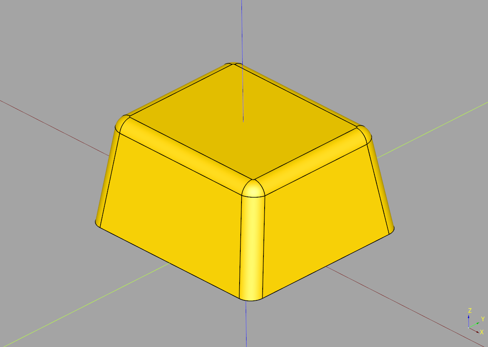
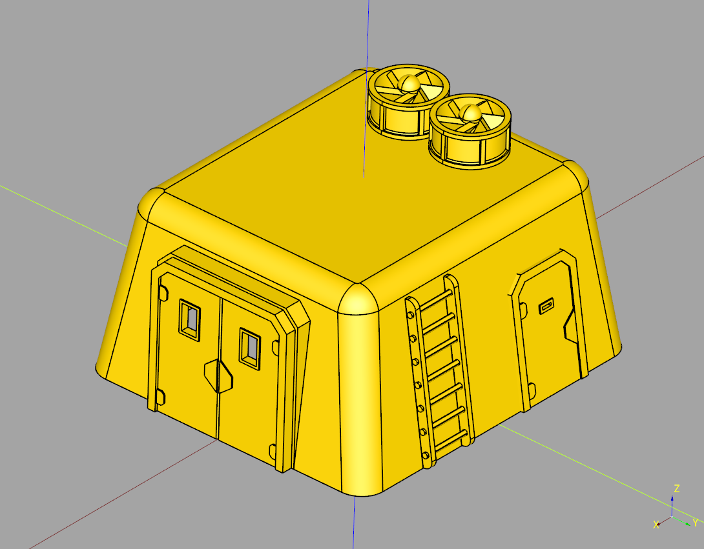

# Depot Documentation

---

## Index
* [Container](#container)
* [Depot](#depot)

---

## Container

### parameters
* length: float
* width: float
* height: float
* top_length: float
* top_width: float
* top_fillet: float
* side_fillet: float
* material_width: float

``` python
import cadquery as cq
from cqindustry.depot import Container

bp_container = Container()

bp_container.length = 126
bp_container.width = 114
bp_container.height = 65

bp_container.top_length = 111
bp_container.top_width = 93
bp_container.top_fillet = 8
bp_container.side_fillet = 9

bp_container.material_width = 1

bp_container.make()

ex_container = bp_container.build()

show_object(ex_container)
```



* [source](../src/cqindustry/depot/Container.py)
* [example](../example/depot/container.py)
* [stl](../stl/depot_container.stl)

---

## Depot

### parameters

### blueprints
* bp_body = [Container](#container)
* bp_fan = [FanIndustrial](https://github.com/medicationforall/cqterrain/blob/main/documentation/greeble.md#fan-industrial)
* bp_ladder = [Ladder](https://github.com/medicationforall/cqterrain/blob/main/documentation/misc.md#ladder)
* bp_window = [ShutterWindow](https://github.com/medicationforall/cqterrain/blob/main/documentation/window.md#shutterwindow)
* bp_double_door = [DoorDouble](https://github.com/medicationforall/cqterrain/blob/main/documentation/door.md#door-double)
* bp_connector = [Frame](https://github.com/medicationforall/cqterrain/blob/main/documentation/door.md#frame)
* bp_single_door = [DoorSingle](https://github.com/medicationforall/cqterrain/blob/main/documentation/door.md#door-single)

``` python
import cadquery as cq
from cqindustry.depot import Depot

bp_container = Depot()
bp_container.make()

ex_container = bp_container.build()

show_object(ex_container)
```



* [source](../src/cqindustry/depot/Depot.py)
* [example](../example/depot/depot.py)
* [stl](../stl/depot.stl)


