# Dome Documentation

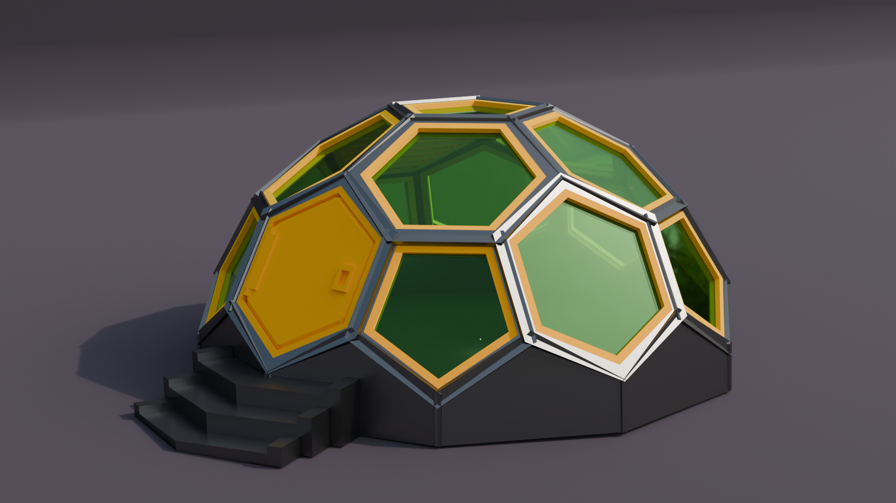

## Dome
Builder class, Makes a complete dome with greebles. 
Inherits from Base.

### parameters
* hex_radius: float
* hex_pen_diff: float
* hex_height: float
* hex_radius_cut: float
* pen_radius: float
* pen_radius_cut: float
* r1_x_rotate: float
* r2_x_rotate: float
* r2_z_rotate: float
* r2_pen_x_rotate: float
* r2_pen_z_rotate: float
* r3_x_rotate: float
* r3_z_rotate: float
* greebles_bp = []
* render_frame: bool
* render_greebles: bool

``` python
import cadquery as cq
from cqdome import Dome, greeble

bp_0 = greeble.CutKeyPentagon()
bp_0.text='0'

bp_1 = greeble.CutKeyHexagon()
bp_1.text='1'


vent_bp = greeble.VentHexagon()
door_bp = greeble.DoorHexagon()
door_bp.hinge_x_translate = -4.5

window_pen_bp = greeble.WindowFrame()
window_pen_bp.type="pentagon"
window_pen_bp.margin=.1

window_hex_bp = greeble.WindowFrame()
window_hex_bp.type="hexagon"

bp = Dome()

#center
bp.greebles_bp.append(window_pen_bp)

#ring 1
bp.greebles_bp.append(vent_bp)
bp.greebles_bp.append(window_hex_bp)
bp.greebles_bp.append(window_hex_bp)
bp.greebles_bp.append(window_hex_bp)
bp.greebles_bp.append(window_hex_bp)

#ring2
bp.greebles_bp.append(window_pen_bp)
bp.greebles_bp.append(window_hex_bp)
bp.greebles_bp.append(window_pen_bp)
bp.greebles_bp.append(window_hex_bp)
bp.greebles_bp.append(window_pen_bp)
bp.greebles_bp.append(door_bp)
bp.greebles_bp.append(window_pen_bp)
bp.greebles_bp.append(window_hex_bp)
bp.greebles_bp.append(window_pen_bp)
bp.greebles_bp.append(door_bp)

bp.render_greebles = True
bp.make()
dome = bp.build()

show_object(dome)
```

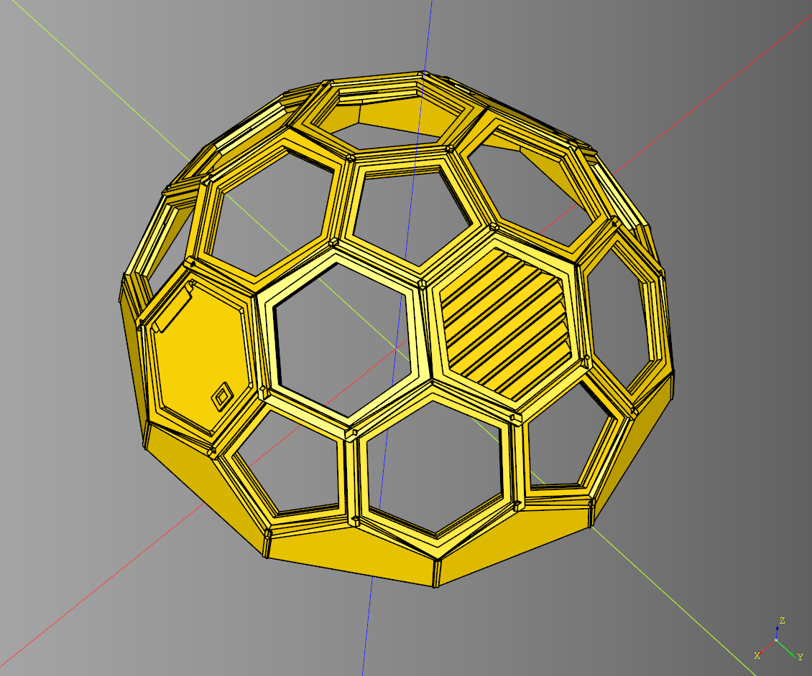

* [source](../src/cqindustry/dome/Dome.py)
* [example](../example/dome/dome.py)
* [stl](../stl/dome_complete.stl)


---


## Base Hexagon
Interface class sets up a couple basic parameters that inheriting classes use. 
Inherits from Base

### parameters
* radius: float
* height: float

---

## Base Hexagon make_hexagon
Utility method for creating a hexagon.

### parameters
* radius:float 
* height:float
* z_rotate:float

``` python
import cadquery as cq
from cqdome.greeble import make_hexagon

hexagon = make_hexagon(
    radius = 30,
    height = 3,
    z_rotate = 30
)

show_object(hexagon)
```

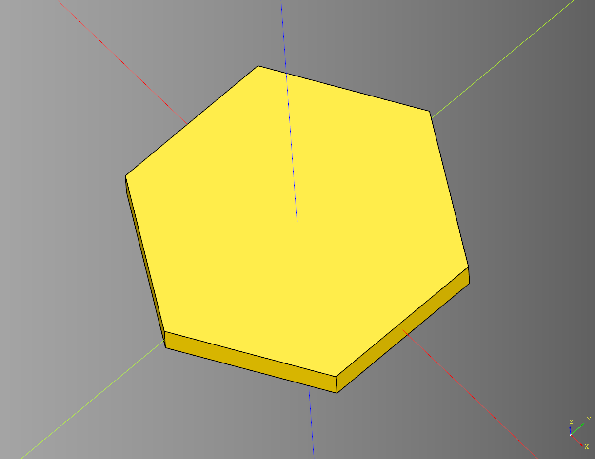

* [source](../src/cqindustry/dome/greeble/BaseHexagon.py)
* [example](../example/dome/make_hexagon.py)
* [stl](../stl/dome_make_hexagon.stl)


---

## Base Pentagon

Interface class sets up a couple basic parameters that inheriting classes use. 
Inherits from Base

### parameters
* radius: float
* height: float

---

## Base Pentagon make_pentagon
Utility method for creating a pentagon.

### parameters
* radius:float 
* height:float
* z_rotate:float

``` python
import cadquery as cq
from cqdome.greeble import make_pentagon

pentagon = make_pentagon(
    radius = 30,
    height = 3,
    z_rotate = 30
)

show_object(pentagon)
```

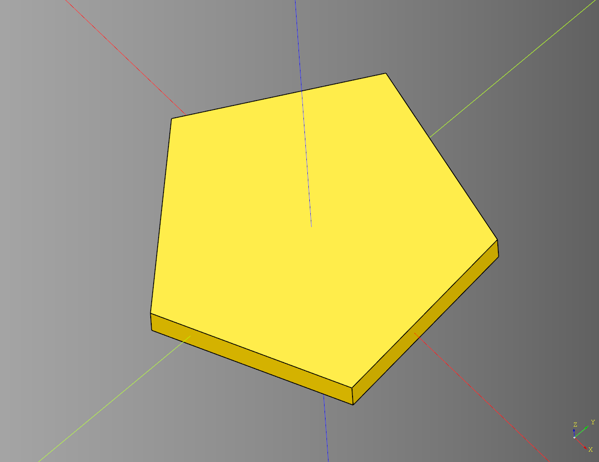

* [source](../src/cqindustry/dome/greeble/BasePentagon.py)
* [example](../example/dome/make_pentagon.py)
* [stl](../stl/dome_make_pentagon.stl)

---

## Cut Key Hexagon
Creates a hexagon window cut key template for making the dome window panels.
Inherits from [BaseHexagon](#base-hexagon)

### parameters
* radius: float
* height: float
* text: str
* text_height: float
* text_size: float
* cut_hole_height: float
* cut_hole_radius: float
* cut_hole_y_translate: float

``` python
import cadquery as cq
from cqdome import greeble

bp = greeble.CutKeyHexagon()
bp.radius = 58
bp.height = 2

#text
bp.text = "MiniForAll" 
bp.text_height = 2
bp.text_size = 10

#cut hole
bp.cut_hole_height = 3
bp.cut_hole_radius = 1.5
bp.cut_hole_y_translate = 17

bp.make()
cut_key = bp.build()

show_object(cut_key)
```

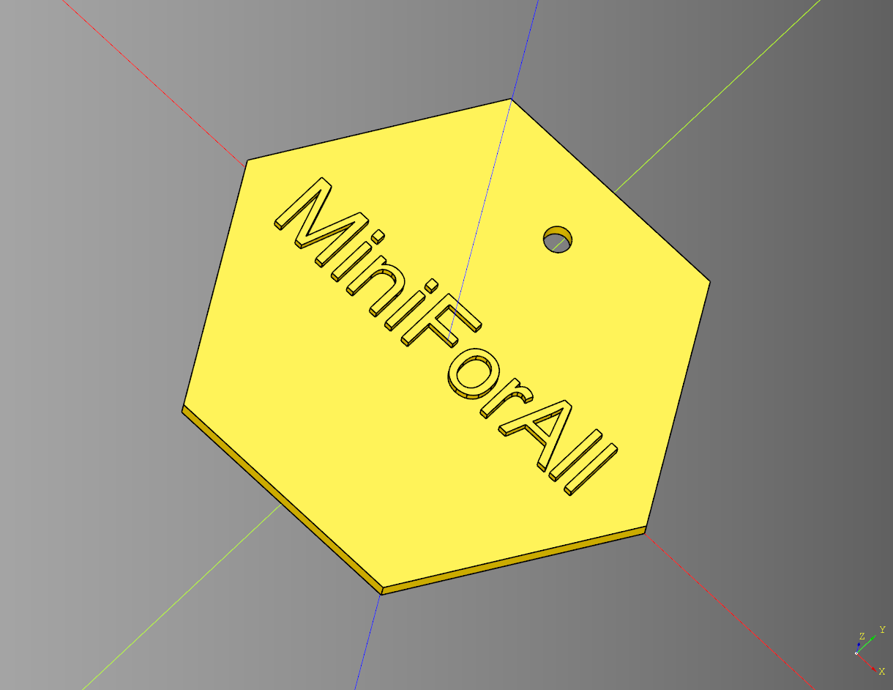

* [source](../src/cqindustry/dome/greeble/CutKeyHexagon.py)
* [example](../example/dome/cut_key_hexagon.py)
* [stl](../stl/dome_cut_key_hexagon.stl)

---

## Cut Key Pentagon
Creates a pentagon window cut key template for making the dome window panels.
Inherits from [BasePentagon](#base-pentagon)

### parameters
* *radius
* height
* text
* text_height
* text_size
* cut_hole_height
* cut_hole_radius
* cut_hole_y_translate

``` python
import cadquery as cq
from cqdome import greeble

bp = greeble.CutKeyPentagon()
bp.radius = 58
bp.height = 2

# text
bp.text = "MiniForAll" 
bp.text_height = 2
bp.text_size = 7

#cut hole
bp.cut_hole_height = 3
bp.cut_hole_radius = 1.5
bp.cut_hole_y_translate = 12

bp.make()
cut_key = bp.build()

show_object(cut_key)
```

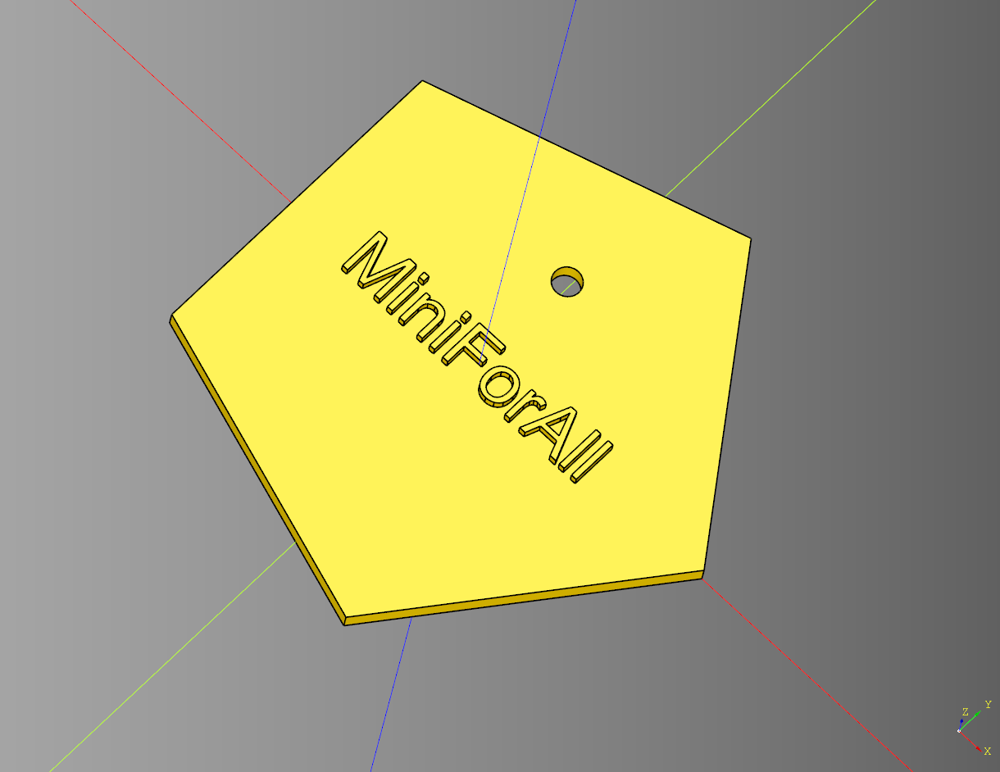

* [source](../src/cqindustry/dome/greeble/CutKeyPentagon.py)
* [example](../example/dome/cut_key_pentagon.py)
* [stl](../stl/dome_cut_key_pentagon.stl)

---

## Door Hexagon
Makes a door hexagon. 
Inherits from [BaseHexagon](#base-hexagon)

### parameters
radius:float
height:float
frame_inset: float
door_padding: float
door_chamfer: float
door_height: float
hinge_length: float
hinge_width: float
hinge_height: float
hinge_cylinder_height: float
hinge_cylinder_radius: float
hinge_x_translate: float
handle_x_translate: float
handle_length: float
handle_width: float

``` python
import cadquery as cq
from cqdome import greeble

bp = greeble.DoorHexagon()
bp.frame_inset = 9

# door
bp.door_padding = .5
bp.door_chamfer = 1.5
bp.door_height = 4

#hinge
bp.hinge_length = 4
bp.hinge_width = 16
bp.hinge_height = 5
bp.hinge_cylinder_height = 20
bp.hinge_cylinder_radius = 2.5
bp.hinge_x_translate= -3.5

# handle
bp.handle_x_translate = 8.5
bp.handle_length = 5
bp.handle_width = 7

bp.make()
door = bp.build()

show_object(door)
```

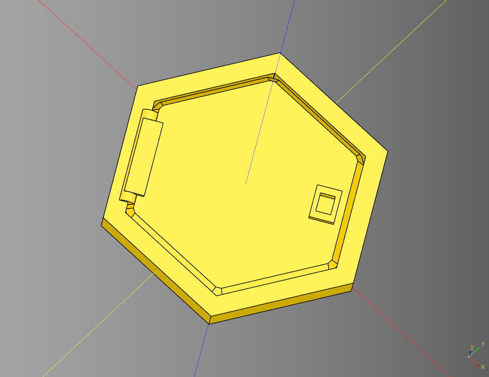

* [source](../src/cqindustry/dome/greeble/DoorHexagon.py)
* [example](../example/dome/door_hexagon.py)
* [stl](../stl/dome_door_hexagon.stl)

---

## make_angled_steps
Helper function that creates angled steps for the dome.

### parameters
* length: float 
* width: float
* height: float
* dec: float

``` python
import cadquery as cq
from cqdome.greeble import make_angled_steps

angled_steps = make_angled_steps(
    length = 30, 
    width = 10, 
    height = 15,
    dec = 5
)

show_object(angled_steps)
```

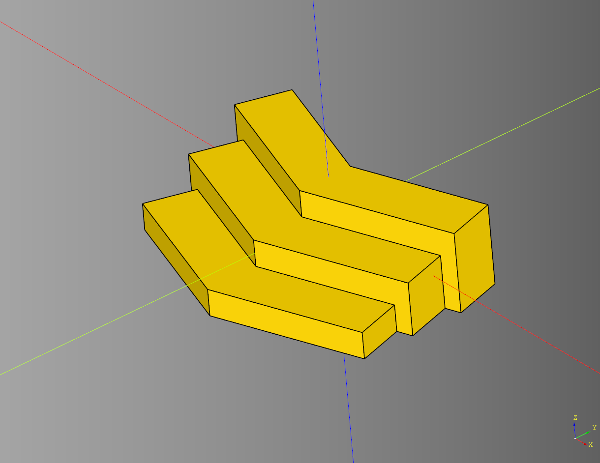

* [source](../src/cqindustry/dome/greeble/angledSteps.py)
* [example](../example/dome/make_angled_steps.py)
* [stl](../stl/dome_angled_steps.stl)


---

## Stairs
Stair class I harcoded hacked together. 
If given a dome as a parent will make the cut out so the stairs can align with the dome. 
Inherits from Base.

### parameters
* display_dome: bool

``` python
import cadquery as cq
from cqdome import Dome
from cqdome import greeble

bp_dome = Dome()
bp_dome.make()

bp_stairs = greeble.Stairs()
bp_stairs.display_dome = False
bp_stairs.make(bp_dome)

example_stairs = bp_stairs.build()

show_object(example_stairs)
```

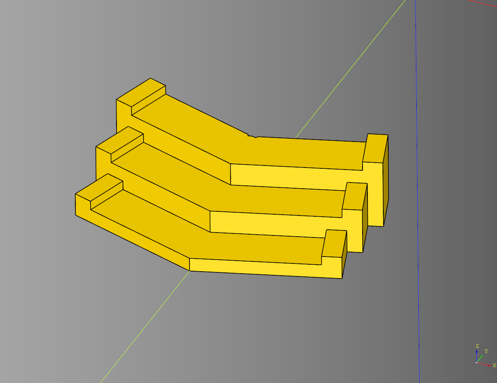

* [source](../src/cqindustry/dome/greeble/Stairs.py)
* [example](../example/dome/stairs.py)
* [stl](../stl/dome_stairs.stl)

---

## Vent Hexagon
Creates a vent greeble for pacing into a dome frame.
Inherits from [BaseHexagon](#base-hexagon)

### parameters
radius: float
height: float
frame_size: float
vent_width: float
vent_space: float
vent_rotate: float

``` python
import cadquery as cq
from cqdome import greeble

bp = greeble.VentHexagon()
bp.radius = 58
bp.height = 4
bp.frame_size = 9
bp.vent_width = 2
bp.vent_space = 0.6
bp.vent_rotate = 45
bp.make()
vent = bp.build()

show_object(vent)
```

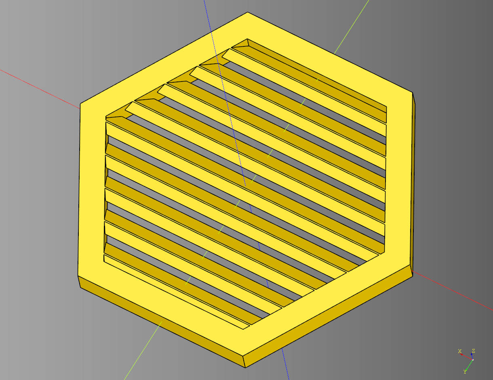

* [source](../src/cqindustry/dome/greeble/VentHexagon.py)
* [example](../example/dome/vent_hexagon.py)
* [stl](../stl/dome_vent_hexagon.stl)

---

## Window Frame
Makes either a hexagon or pentagon window frame. 
Inherits from [BaseHexagon](#base-hexagon)

### parameters
* type: Literal["hexagon", "pentagon"]
* radius: float
* height: float
* margin: float - used when determing outside radius
* pane_height: float - internal cut height
* inner_pane_padding: float
* pane_rail_translate: float 
* frame_size: float
* render_pane:bool = False


``` python
import cadquery as cq
from cqdome.greeble import WindowFrame

bp_window = WindowFrame()
bp_window.type= "hexagon" # hexagon, pentagon
bp_window.radius = 58
bp_window.height = 4
bp_window.margin = 0 # used when determing outside radius

bp_window.pane_height = 1 # internal cut height
bp_window.inner_pane_padding = 2
bp_window.pane_rail_translate = 0 
bp_window.frame_size = 5

bp_window.render_pane = False

bp_window.make()
ex_window= bp_window.build()

show_object(ex_window)
```

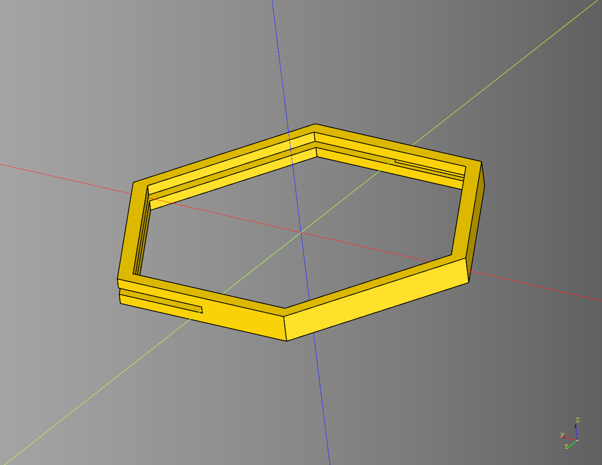

### pentagon example
``` python
import cadquery as cq
from cqdome.greeble import WindowFrame

bp_window = WindowFrame()
bp_window.type= "pentagon" # hexagon, pentagon
bp_window.radius = 58
bp_window.height = 4
bp_window.margin = 0 # used when determing outside radius

bp_window.pane_height = 1 # internal cut height
bp_window.inner_pane_padding = 2
bp_window.pane_rail_translate = 0 
bp_window.frame_size = 5

bp_window.render_pane = False

bp_window.make()
ex_window= bp_window.build()

show_object(ex_window)
```

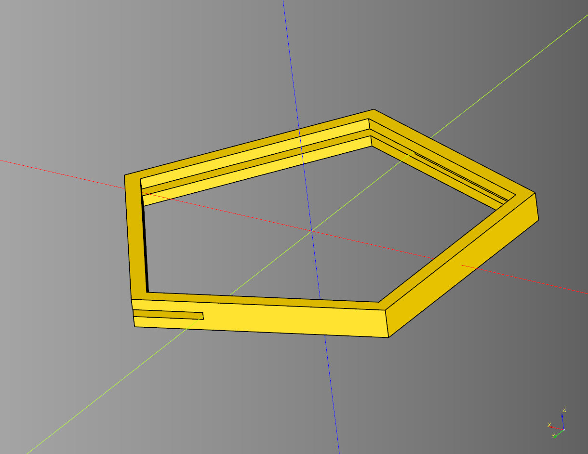

* [source](../src/cqindustry/dome/greeble/WindowFrame.py)
* [example](../example/dome/window_frame.py)
* [hexagon stl](../stl/dome_window_frame_hexagon.stl)
* [pentagon stl](../stl/dome_window_frame_pentagon.stl)
---