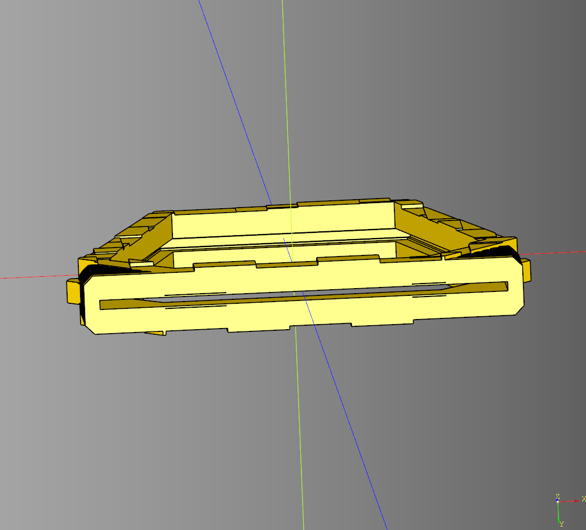

# Portal Documentation

Code for creating portal models with print in place hinges. 


---

## Base Coffin

### parameters
* length: float
* width: float
* height: float
* top_length: float - Length at the top of the shape
* base_length: float - Length at the base of the shape
* base_offset: float - offset distance from the base of the shape

### shapes
* coffin: cq.Workplane|None - Base shape generated in the make lifecycle


``` python
import cadquery as cq
from cqindustry.portal import BaseCoffin

bp = BaseCoffin()
bp.length = 150
bp.width = 5
bp.height = 150
bp.top_length = 90
bp.base_length = 100
bp.base_offset = 35 # offset distance from the base of the ramp
bp.make()
ex = bp.build()

show_object(ex)
```


* [source](../src/cqindustry/portal/BaseCoffin.py)
* [example](../example/portal/base_coffin.py)
* [stl](../stl/portal_base_coffin.stl)

---

## Coffin Textured
Inherits from [BaseCoffin](#base-coffin)

### parameters
* seed: string|None = 'rabblerabble'
* max_columns: int
* max_rows: int
* col_size: float
* row_size: float
* passes_count: int

``` python
import cadquery as cq
from cqindustry.portal import CoffinTextured

bp_coffin = CoffinTextured()
bp_coffin.seed = 'rough'

bp_coffin.max_columns = 4
bp_coffin.max_rows = 2
bp_coffin.col_size = 15
bp_coffin.row_size = 15

bp_coffin.passes_count = 36
bp_coffin.make()

coffin = bp_coffin.build()

#show_object(coffin)
```


* [source](../src/cqindustry/portal/CoffinTextured.py)
* [example](../example/portal/coffin_textured.py)
* [stl](../stl/portal_coffin_textured.stl)

---

## Energy Insert

### parameters
* length: float
* height: float
* width: float
* top_length: float
* base_length: float
* base_offset: float
* base_height: float
* uneven_plane_height: float
* uneven_min_height: float
* uneven_plane_seed: str|None
* uneven_peak_count: int| Tuple[int, int]
* uneven_segments: int
* uneven_spacer: float
* uneven_step: float
* uneven_plate_height: float
* truchet_tolerance: float
* truchet_seed: str|None
* debug_plane: bool
* render_truchet_grid: bool
* truchet_chamfer: float


``` python
import cadquery as cq
from cqindustry.portal import EnergyInsert

bp_iris = EnergyInsert()
bp_iris.length = 150
bp_iris.height = 150
bp_iris.width = 5
bp_iris.top_length = 90
bp_iris.base_length = 100
bp_iris.base_offset = 35
bp_iris.base_height = 10
bp_iris.uneven_plane_seed = 'left'
bp_iris.uneven_peak_count = (5,6)
bp_iris.uneven_segments = 10
bp_iris.uneven_spacer = 2.25
bp_iris.uneven_step = .5
bp_iris.truchet_tolerance = 0.05
bp_iris.truchet_seed = 'retro'
bp_iris.debug_plane = False
bp_iris.make()

iris = bp_iris.build()

show_object(iris)
```


* [source](../src/cqindustry/portal/EnergyInsert.py)
* [example](../example/portal/energy_insert.py)
* [stl](../stl/portal_energy_insert.stl)

---

## Frame

### parameters
* length: float
* width: float
* height:float
* top_length: float - length at the top of the frame
* base_length: float - length at the base of the frame
* base_offset: float - offset distance from the center of the frame
* side_inset: float - The amount the inset the side frames in relation to the center.
* frame_size:float - distance from the outside wall and the inside wall.
* render_sides: bool 

### shapes
* frame: cq.Workplane|None - stores the generated from from the make lifecycle


``` python
import cadquery as cq
from cqindustry.portal import Frame

bp_frame = Frame()
bp_frame.length = 150
bp_frame.width = 15
bp_frame.height = 150
bp_frame.top_length = 90 # length at the top of the frame
bp_frame.base_length = 100 # length at the base of the frame
bp_frame.base_offset = 35 # offset distance from the center of the frame
bp_frame.side_inset = 8 # The amount the inset the side frames in relation to the center.
bp_frame.frame_size = 10 # distance from the outside wall and the inside wall.
bp_frame.make()

result = bp_frame.build()

show_object(result)
```

* [source](../src/cqindustry/portal/Frame.py)
* [example](../example/portal/frame.py)
* [stl](../stl/portal_frame.stl)
  
---

## Frame Block
Portal frame textured with uneven blocks. Inherits from [Frame](#frame)

### parameter
* seed:str|None
* max_columns:int
* max_rows:int
* col_size:float
* row_size:float
* passes_count:int
* power_offset:float

### blueprints
* bp_power: CapGreeble|None
  
``` python
import cadquery as cq
from cqindustry.portal import FrameBlock

bp_frame = FrameBlock()
bp_frame.length = 150
bp_frame.width = 22
bp_frame.height = 150
bp_frame.top_length = 90 # length at the top of the frame
bp_frame.base_length = 100 # length at the base of the frame
bp_frame.base_offset = 35 # offset distance from the center of the frame
bp_frame.side_inset = 8 # The amount the inset the side frames in relation to the center.
bp_frame.frame_size = 10 # distance from the outside wall and the inside wall.
bp_frame.render_sides = True

bp_frame.seed = 'test'
bp_frame.max_columns = 2
bp_frame.max_rows = 3
bp_frame.col_size = 10
bp_frame.row_size = 10
bp_frame.passes_count = 1000
bp_frame.power_offset  = 4

bp_frame.make()

result = bp_frame.build()

show_object(result)
```


* [source](../src/cqindustry/portal/FrameBlock.py)
* [example](../example/portal/frame_block.py)
* [stl](../stl/portal_frame_block.stl)

---

## Frame Window
Inherits from the [Frame](#frame) class. Adds a cutout for a window insert cut from a different material using the generate cut key.

### parameters
* window_cut_width: float
* window_cut_padding: float
* window_key_width: float
* window_key_padding: float
* window_key_text: str
* window_key_text_size: float
* window_key_text_height: float

The width of the center frame and the two side frame is calculated by dividing the width parameter by 3.

### shapes
* window_cut_out: cq.Workplane|None
* window_cut_key: cq.Workplane|None

``` python
import cadquery as cq
from cqindustry.portal import FrameWindow

bp_frame = FrameWindow()
bp_frame.length = 150
bp_frame.width = 20
bp_frame.height = 150
bp_frame.top_length = 90 # length at the top of the frame
bp_frame.base_length = 100 # length at the base of the frame
bp_frame.base_offset = 35 # offset distance from the center of the frame
bp_frame.side_inset = 8 # The amount the inset the side frames in relation to the center.
bp_frame.frame_size = 10 # distance from the outside wall and the inside wall.
bp_frame.render_sides = True

bp_frame.window_cut_width = 0.4
bp_frame.window_cut_padding = 1

bp_frame.window_key_width = 2
bp_frame.window_key_padding = 0.8

bp_frame.window_key_text = "Portal Key"
bp_frame.window_key_text_size = 10
bp_frame.window_key_text_height = 1
bp_frame.make()

result = bp_frame.build()

show_object(result.translate((bp_frame.length/2,0,bp_frame.height/2)))
show_object(bp_frame.window_cut_key.translate((-(bp_frame.length/2),0,0)))
```


* [source](../src/cqindustry/portal/FrameWindow.py)
* [example](../example/portal/frame_window.py)
* [stl](../stl/portal_frame_window.stl)

---

## Frame Window Block

Inherits from the [FrameBlock](#frame-block) class. Adds a cutout for a window insert see [Energy Insert](#energy-insert).

### parameters
* window_cut_width:float
* window_cut_padding:float

``` python
import cadquery as cq
from cqindustry.portal import FrameWindowBlock

bp_frame = FrameWindowBlock()
bp_frame.length = 150
bp_frame.width = 22
bp_frame.height = 150
bp_frame.top_length = 90 # length at the top of the frame
bp_frame.base_length = 100 # length at the base of the frame
bp_frame.base_offset = 35 # offset distance from the center of the frame
bp_frame.side_inset = 8 # The amount the inset the side frames in relation to the center.
bp_frame.frame_size = 10 # distance from the outside wall and the inside wall.
bp_frame.render_sides = True

bp_frame.seed = 'test'
bp_frame.max_columns = 2
bp_frame.max_rows = 3
bp_frame.col_size = 10
bp_frame.row_size = 10
bp_frame.passes_count = 1000
bp_frame.power_offset  = 4

bp_frame.window_cut_width = 3
bp_frame.window_cut_padding = 1

bp_frame.make()

result = bp_frame.build()

show_object(result)
```




* [source](../src/cqindustry/portal/FrameWindowBlock.py)
* [example](../example/portal/frame_window_block.py)
* [stl](../stl/portal_frame_window_block.stl)
---

## Portal
Orchestration component. Combines a base, a frame, two ramps, and two hinges. All of the subcomponent blueprints can be swapped out for customization.

### parameters
* render_base: bool
* render_hinges: bool
* hinge_segments: int
* plate_spacer: float

### blueprints
* bp_base = [PortalBase](#portal-base)
* bp_frame = [Frame](#frame)
* bp_ramp = [Ramp](#ramp)()
* bp_hinge = [PortalHinge](#portal-hinge)()

``` python
import cadquery as cq
from cqindustry.portal import Portal

bp_portal = Portal()
bp_portal.bp_frame.length = 150
bp_portal.bp_frame.width = 30
bp_portal.bp_frame.height = 150

bp_portal.render_base = False
bp_portal.render_hinges = True
bp_portal.bp_ramp.width = 10
bp_portal.make()


result_open = bp_portal.build()
show_object(result_open)
#cq.exporters.export(result_open, 'stl/portal_open.stl')

bp_portal.bp_hinge.rotate_deg = -90
bp_portal.make()

result_closed = bp_portal.build()
show_object(result_closed.translate((-170,0,0)))
#cq.exporters.export(result_closed, 'stl/portal_closed.stl')
```


* [source](../src/cqindustry/portal/Portal.py)
* [example](../example/portal/portal.py)
* [stl open](../stl/portal_open.stl)
* [stl closed](../stl/portal_closed.stl)

---
## Portal Base
Stub component meant to be replaced with a more greebled component.

### parameters
* length: float
* width: float
* height: float

``` python
import cadquery as cq
from cqindustry.portal import PortalBase

bp_portal_base = PortalBase()
bp_portal_base.length = 150
bp_portal_base.width = 75
bp_portal_base.height = 10

bp_portal_base.make()
result = bp_portal_base.build()

#show_object(result)
```


* [source](../src/cqindustry/portal/PortalBase.py)
* [example](../example/portal/portalBase.py)
* [stl](../stl/portal_base.stl)

---
## Portal Hinge
Inherits from [Hinge](https://github.com/medicationforall/cadqueryhelper/blob/main/documentation/hinge.md)
<br />
This class takes a parent component on make and aligns it to the generated hinge. Also takes care of rotation.
<br />
**Note** this class requires a parent passed in for it's *make* call

### parameters
* ramp_bottom_margin: float
* tab_height: float
* tab_z_translate: float

### shapes
* ramp_hinge_cut: cq.Workplane|None

``` python
import cadquery as cq
from cqindustry.portal import PortalHinge, Ramp

bp_ramp = Ramp()
bp_ramp.make()

bp_hinge = PortalHinge()

bp_hinge.length = 80
bp_hinge.radius = 2.5
bp_hinge.segments = 5
bp_hinge.pad = 1

bp_hinge.base_inset = 0.6
bp_hinge.key_length = 1.5
bp_hinge.key_width = 0.5

bp_hinge.tab_length = 10
bp_hinge.rotate_deg = -30
bp_hinge.plate_spacer = 0.4

bp_hinge.ramp_bottom_margin = 0
bp_hinge.tab_height = bp_hinge.radius*2
bp_hinge.tab_z_translate = bp_hinge.radius

bp_hinge.make(bp_ramp)

hinge_ex = bp_hinge.build()

show_object(hinge_ex)
```


* [source](../src/cqindustry/portal/PortalHinge.py)
* [example](../example/portal/portal_hinge.py)
* [stl](../stl/portal_hinge.stl)

---

## Ramp

### parameters
* length: float
* width: float
* height: float
* top_length: float
* base_length: float
* base_offset: float - offset distance from the base of the ramp
* side_inset: float = 8
* frame_size: float = 10
* inside_margin: float = 0.4
* render_outside:bool = True
* render_inside:bool = True

### blueprints
* bp_outside = [BaseCoffin](#basecoffin)()
* bp_inside = [BaseCoffin](#basecoffin)()


``` python
import cadquery as cq
from cqindustry.portal import Ramp

bp_ramp = Ramp()
bp_ramp.length = 150
bp_ramp.width = 10
bp_ramp.height = 150
bp_ramp.top_length = 90
bp_ramp.base_length = 100
bp_ramp.base_offset = 35 # offset distance from the base of the ramp

bp_ramp.side_inset = 8
bp_ramp.frame_size = 10
bp_ramp.inside_margin = 0.4

bp_ramp.render_outside = True
bp_ramp.render_inside = True

bp_ramp.make()
result = bp_ramp.build()

show_object(result)
```


* [source](../src/cqindustry/portal/Ramp.py)
* [example](../example/portal/ramp.py)
* [stl](../stl/portal_ramp.stl)

---

## Ramp Greebled
Greebled ramp that inherits from [Ramp](#ramp).

### parameters
* segment_count: int
* segment_x_padding: float
* segment_y_padding: float
* segment_depth: float
* render_inside_outline: bool

### shapes
* inside_segments: cq.Workplane|None
* inside_outline: cq.Workplane|None

``` python
import cadquery as cq
from cqindustry.portal import RampGreebled

bp_ramp = RampGreebled()
#bp_ramp.length = 70
#bp_ramp.width = 10
#bp_ramp.height = 150
#bp_ramp.top_length = 60
bp_ramp.base_length = 80

bp_ramp.segment_x_padding = 1
bp_ramp.render_inside = True
bp_ramp.render_inside_outline = False
bp_ramp.make()
ex_ramp = bp_ramp.build()

show_object(ex_ramp)
```


* [source](../src/cqindustry/portal/RampGreebled.py)
* [example](../example/portal/rampGreebled.py)
* [stl](../stl/portal_ramp_greebled.stl)

---

## Ramp Greebled Two
Greebled ramp that inherits from [RampGreebled](#ramp-greebled).

### parameters


``` python
import cadquery as cq
from cqindustry.portal import RampGreebledTwo

bp_ramp = RampGreebledTwo()
#bp_ramp.length = 70
#bp_ramp.width = 10
#bp_ramp.height = 150
#bp_ramp.top_length = 60
bp_ramp.base_length = 80

bp_ramp.segment_x_padding = 1
bp_ramp.render_inside = True
bp_ramp.render_inside_outline = False
bp_ramp.make()
ex_ramp = bp_ramp.build()

show_object(ex_ramp)
```


* [source](../src/cqindustry/portal/RampGreebledTwo.py)
* [example](../example/portal/ramp_greebled_two.py)
* [stl](../stl/portal_ramp_greebled_two.stl)
