# PowerStation Documentation

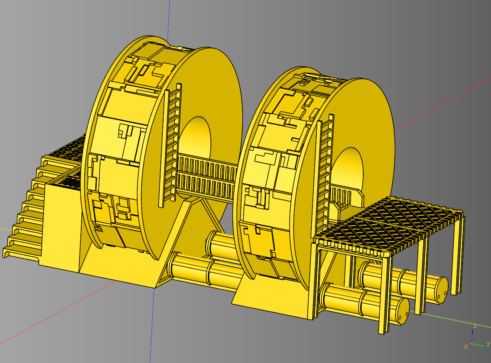

## ControlPlatform
Builder class for making a control platform. Inherits from Base.
The generated shape is one part.

### parameters
* length: float
* width: float
* height: float

### blueprints
* platform_bp: Platform
* bp_frame: SteelFrame

``` python
import cadquery as cq
from cqspoolterrain import ControlPlatform

bp_control = ControlPlatform()
bp_control.length = 150
bp_control.width = 75
bp_control.height = 70

bp_p = bp_control.platform_bp
bp_p.height = 5
bp_p.corner_chamfer = 4

bp_p.render_floor = True
bp_p.render_stripes = True
bp_p.bar_width = 10
bp_p.stripe_width = 5
bp_p.stripe_padding = .3

bp_control.make()
control_platform = bp_control.build()

show_object(control_platform)
```

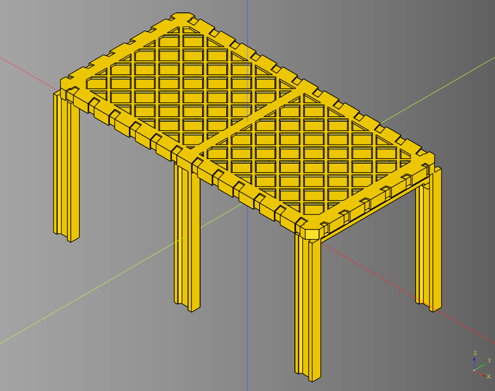

#### alternate example
The steelframe blueprint will adjust the supports for the given dimensions
``` python
import cadquery as cq
from cqspoolterrain import ControlPlatform

bp_control = ControlPlatform()
bp_control.length = 75*3
bp_control.width = 75*2
bp_control.height = 70

bp_p = bp_control.platform_bp
bp_p.height = 5
bp_p.corner_chamfer = 4

bp_p.render_floor = True
bp_p.render_stripes = True
bp_p.bar_width = 10
bp_p.stripe_width = 5
bp_p.stripe_padding = .3

bp_control.make()
control_platform = bp_control.build()

show_object(control_platform)
```

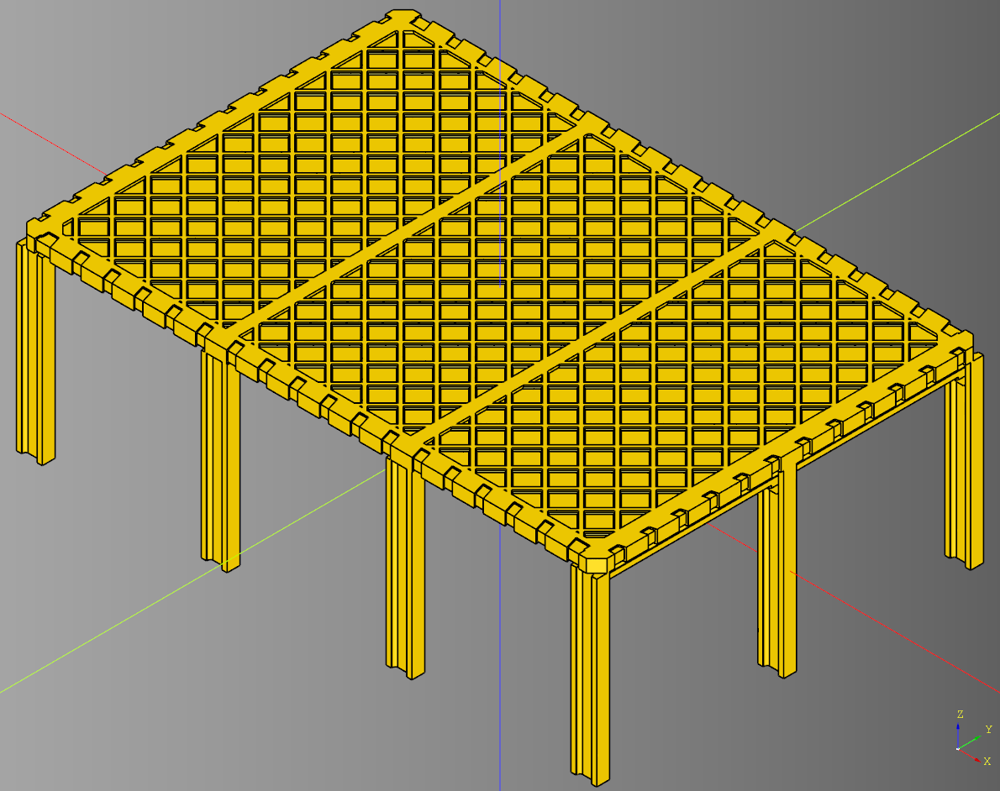

* [source](../src/cqindustry/power/ControlPlatform.py)
* [example](../example/power/controlPlatform.py)
* [example alternate](../example/power/controlPlatformAlt.py)
* [stl](../stl/power_control_platform.stl)
* [stl alternate](../stl/power_control_platform_alt.stl)

---

## ControlPlatformPrint
Builder class for making a control platform. Inherits from Base.
The generated shape is a collection of parts.

### parameters
* length: float
* width: float
* height: float
* segment_width: float
* segment_length: float
* y_width: float
* y_height: float
* frame_insert_height: float
* frame_insert_height_margin: float
* frame_insert_margin: float

### blueprints
* platform_bp: Platform
* bp_frame: SteelFrame
* bp_frame_insert: SteelFrame

``` python
import cadquery as cq
from cqspoolterrain import ControlPlatformPrint

bp_control = ControlPlatformPrint()
bp_control.length = 150
bp_control.width = 75
bp_control.height = 71

bp_control.y_height = 8
bp_control.frame_insert_margin = .6
bp_control.frame_insert_height = 1
bp_control.frame_insert_height_margin = 1

bp_p = bp_control.platform_bp
bp_p.height = 4
bp_p.corner_chamfer = 4

bp_p.render_floor = True
bp_p.render_stripes = True
bp_p.bar_width = 10
bp_p.stripe_width = 5
bp_p.stripe_padding = .3

bp_control.make()

control_platform = bp_control.build()
show_object(control_platform.translate((0,0,3)))
```


Build Platform
``` python
platform = bp_control.build_print_patform()
show_object(platform)
```

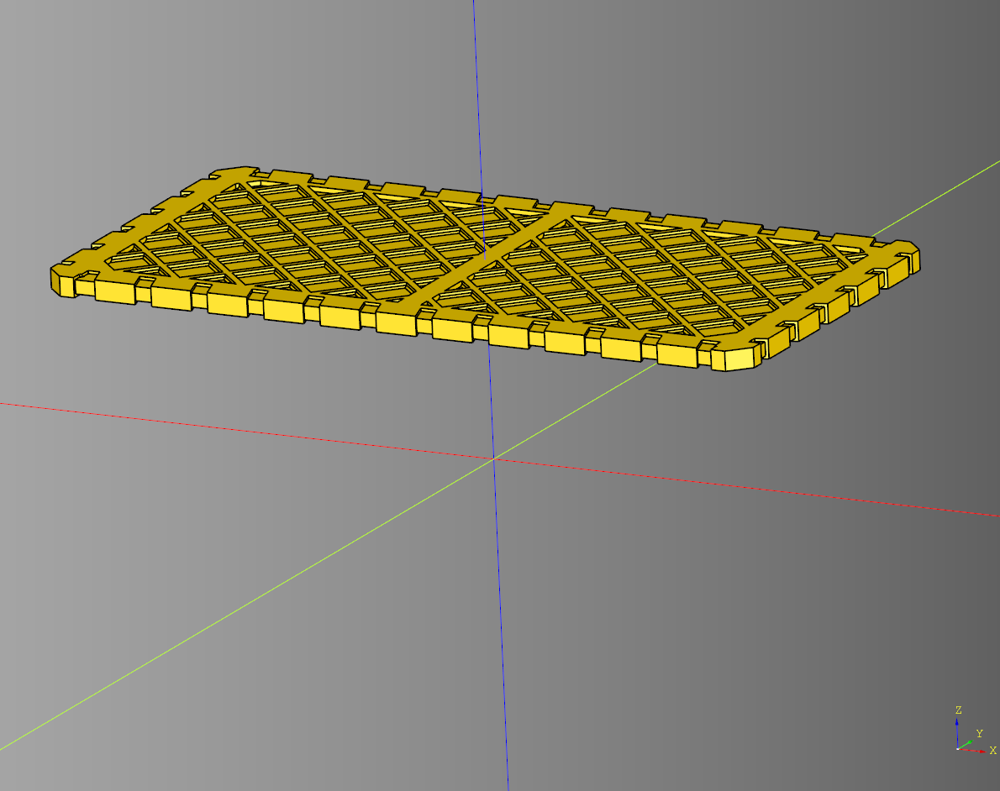

Build Frame
``` python
frame = bp_control.build_print_frame()
show_object(frame)
``` 

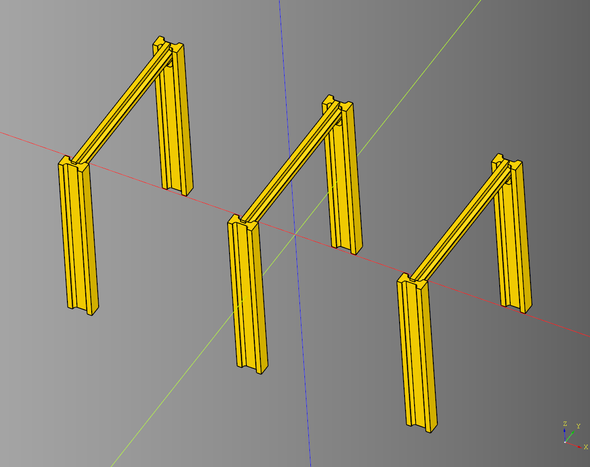

Build Frame Single
``` python
frame_single = bp_control.build_print_frame_single()
show_object(frame_single)
``` 

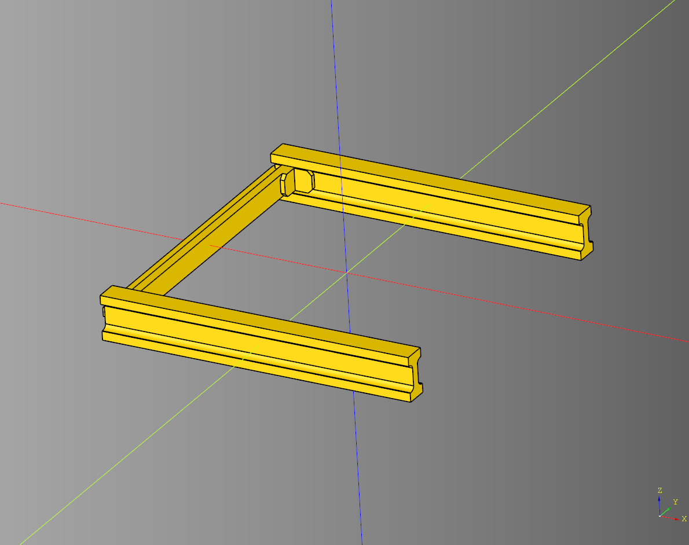

* [source](../src/cqindustry/power/ControlPlatformPrint.py)
* [example](../example/power/controlPlatformPrint.py)
* [stl complete](../stl/power_control_platform_print.stl)
* [stl platform](../stl/power_control_platform_platform.stl)
* [stl frame](../stl/power_control_platform_frame.stl)
* [stl frame single](../stl/power_control_platform_frame_single.stl)

---

## Cradle
Makes the spool cutout based on a passed in parent. 

### parameters
* length: float
* width: float
* height: float
* angle: float
* spool_padding: float
* cut_side_width: float
* cut_side_padding: float

``` python
import cadquery as cq
from cqspoolterrain import Spool,Cradle

bp_spool = Spool()
bp_spool.make()
spool_ex = (
      bp_spool.build()
      .rotate((1,0,0),(0,0,0),90)
      .translate((0,0,bp_spool.radius))
)

bp = Cradle()
bp.height = bp_spool.radius - bp_spool.cut_radius+2
bp.angle = 45
bp.make(bp_spool)
cradle_ex = bp.build().translate((0,0,bp.height/2))
show_object(cradle_ex)
```

Note the spool is passed to the make method
``` python
bp.make(bp_spool)
```

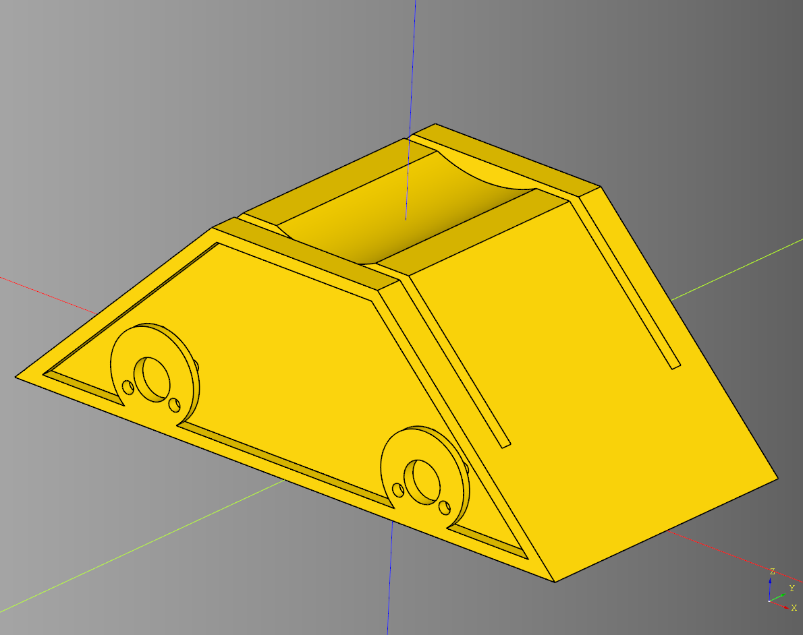

* [source](../src/cqindustry/power/Cradle.py)
* [example](../example/power/cradle.py)
* [stl](../stl/power_cradle.stl)

---

## PowerStation

### parameters
* p_spool: dict
* p_cradle: dict
* p_stairs: dict
* ladder_raise: float
* ladder_increase: float
* render_stairs: bool
* render_control: bool
* render_spool: bool
* render_walkway: bool
* render_cradle: bool
* render_cladding: bool
* render_ladder: bool

### blueprints
* bp_spool: Spool
* bp_cradle: Cradle
* bp_walk: Walkway
* bp_stairs: StairLift
* bp_control: ControlPlatform
* bp_cladding: SpoolCladding
* bp_ladder: Ladder

### plain example
``` python
import cadquery as cq
from cqspoolterrain import PowerStation

bp_power = PowerStation()

bp_power.make()
power = bp_power.build()
show_object(power)
```

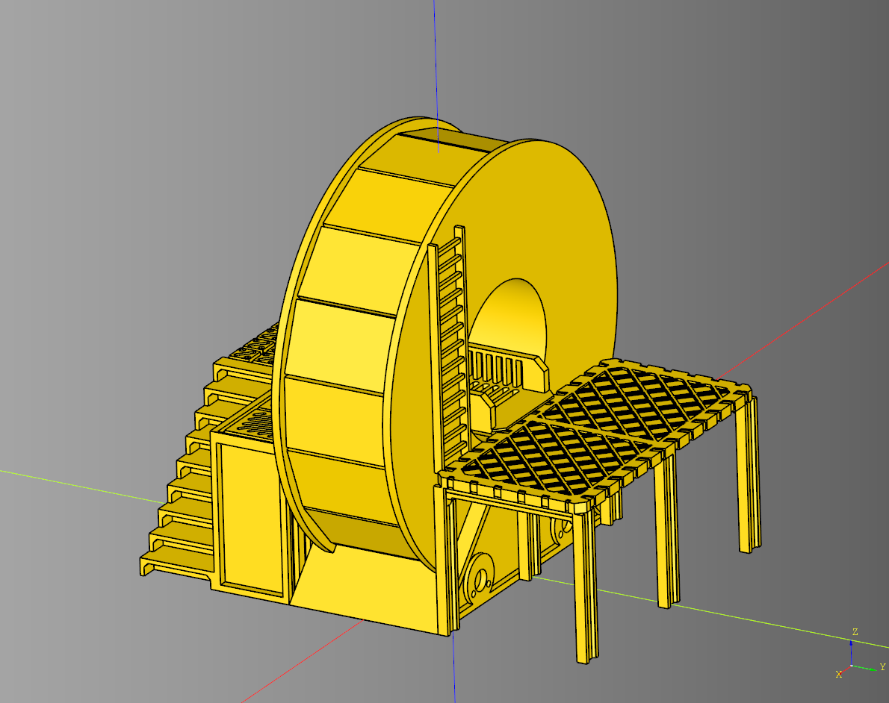

### unique panels example
``` python
import cadquery as cq
from cqspoolterrain import PowerStation, SpoolCladdingGreebledUnique

bp_power = PowerStation()
bp_power.bp_stairs.overlook_tile_size = 10
bp_power.bp_stairs.bp_stairs.stair_chamfer = None


bp_power.bp_cladding = SpoolCladdingGreebledUnique()
bp_power.bp_cladding.seed="uniquePanels"

bp_power.render_spool = True
bp_power.render_cladding = True
bp_power.render_cradle = True
bp_power.render_stairs = True
bp_power.render_control = True
bp_power.render_walkway = True
bp_power.render_ladder = True

bp_power.make()
power = bp_power.build()
platform = bp_power.bp_control.build()

show_object(power)
```

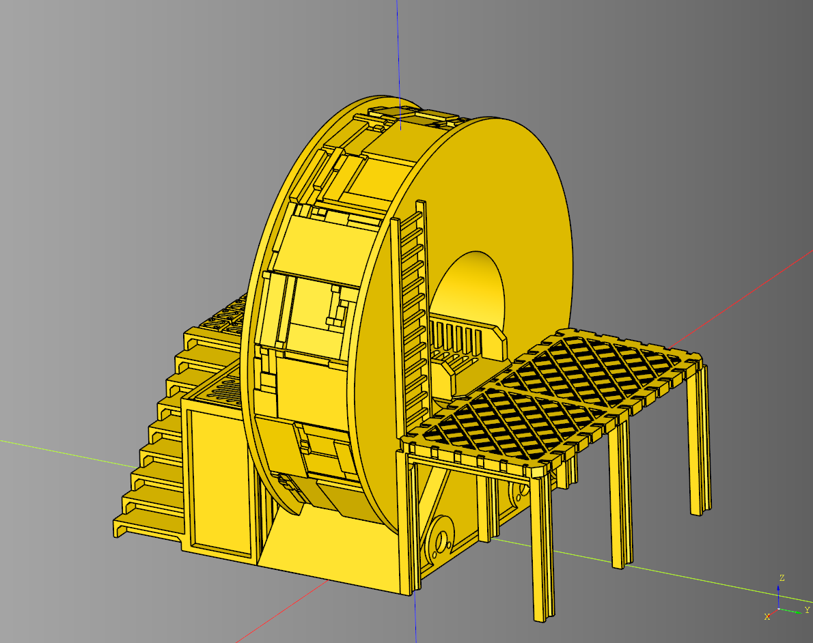

### build_assembly lifecycle
To generate the collection of parts as an assembly use the build_assembly method.

``` python
import cadquery as cq
from cqspoolterrain import PowerStation, SpoolCladdingGreebledUnique

bp_power = PowerStation()
bp_power.bp_stairs.overlook_tile_size = 10
bp_power.bp_stairs.bp_stairs.stair_chamfer = None


bp_power.bp_cladding = SpoolCladdingGreebledUnique()
bp_power.bp_cladding.seed="uniquePanels"

bp_power.render_spool = True
bp_power.render_cladding = True
bp_power.render_cradle = True
bp_power.render_stairs = True
bp_power.render_control = True
bp_power.render_walkway = True
bp_power.render_ladder = True

bp_power.make()
power = bp_power.build_assembly()

show_object(power)

power.export("gltf/power_assembly.gltf")
```

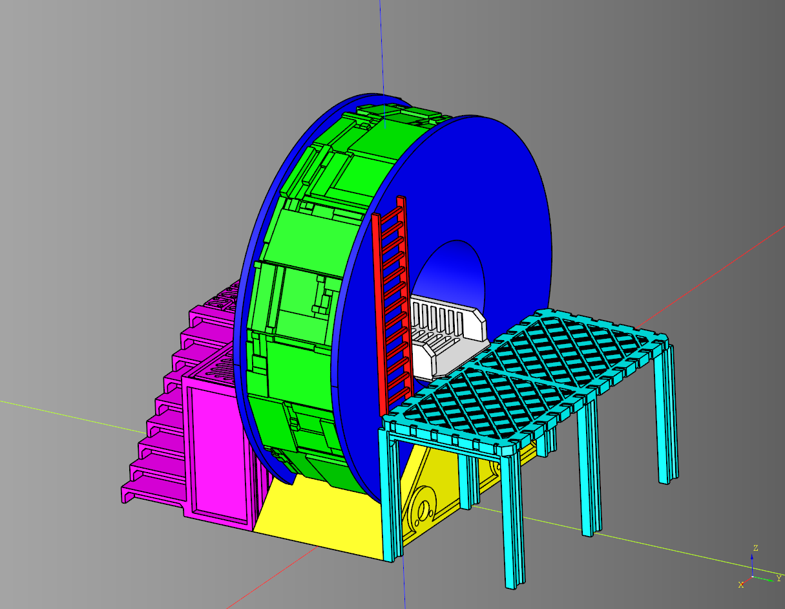

* [source](../src/cqindustry/power/PowerStation.py)
* [example](../example/powerStationPlain.py)
* [example unique](../example/power/powerStationGreebledUniquePanels.py)
* [example assembly](../example/power/powerStationGreebledUniquePanelsAssembly.py)
* [stl](../stl/power_powerStation.stl)
* [stl unique](../stl/power_powerStation_seed_uniquePanels.stl)
* [stl assembly](../gltf/power_assembly.gltf)

---

## SpoolCladding
Plain Part that wraps around the spool.

### parameters
* start_angle: float
* end_angle: float
* rotate_solid: bool
* count: int
* clad_height: float
* clad_width: float
* clad_inset: float

``` python
import cadquery as cq
from cqspoolterrain import Spool, SpoolCladding

# --- Spool
bp_spool = Spool()
bp_spool.height = 60
bp_spool.radius = 97.5
bp_spool.wall_width =4
bp_spool.cut_radius = 36.5
bp_spool.make()
ex_spool = bp_spool.build()

# --- Claddding
bp_cladding = SpoolCladding()
bp_cladding.make(bp_spool)
cladding = bp_cladding.build()

scene = (
    cq.Workplane("XY")
    .add(ex_spool)
    .add(cladding)
)

show_object(scene)
```
Note the spool is passed to the make method of the cladding.

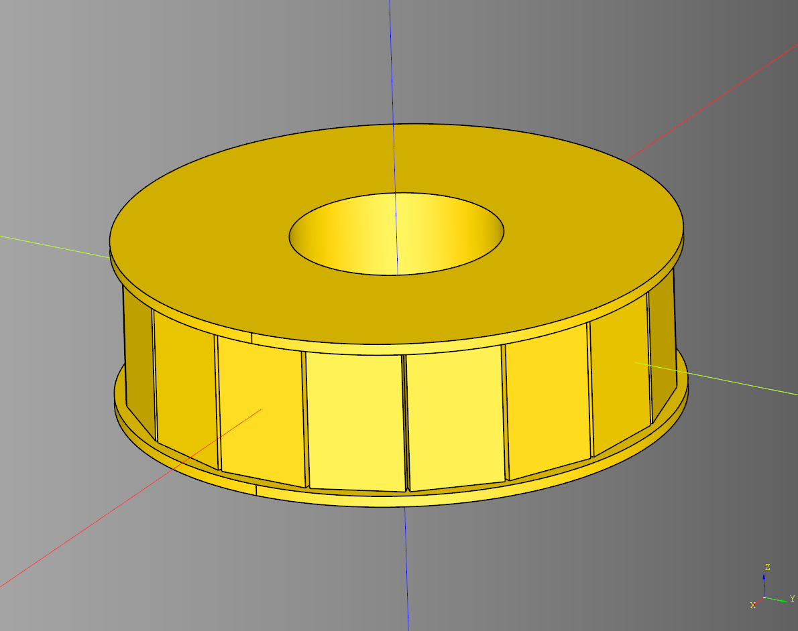

* [source](../src/cqindustry/power/SpoolCladding.py)
* [example](../example/power/spoolCladding.py)
* [stl](../stl/power_spool_cladding.stl)

---

## SpoolCladdingGreebled
Greebled Part that wraps around the spool.

### parameters
* seed: str

``` python
import cadquery as cq
from cqspoolterrain import Spool, SpoolCladdingGreebled

# --- Spool
bp_spool = Spool()
bp_spool.height = 60
bp_spool.radius = 97.5
bp_spool.wall_width =4
bp_spool.cut_radius = 36.5
bp_spool.make()
ex_spool = bp_spool.build()

# --- Cladding
bp_cladding = SpoolCladdingGreebled()
bp_cladding.seed = "test4"
bp_cladding.make(bp_spool)
cladding = bp_cladding.build()

scene = (
    cq.Workplane("XY")
    .add(ex_spool)
    .add(cladding)
)

show_object(scene)
```

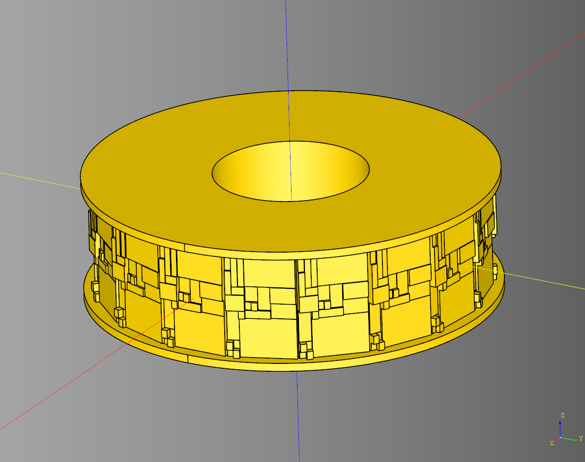

* [source](../src/cqindustry/power/SpoolCladdingGreebled.py)
* [example](../example/power/spoolCladdingGreebled.py)
* [stl](../stl/power_spool_cladding_greebled.stl)

---

## SpoolCladdingGreebledUnique
Greebled Part that wraps around the spool. Each panel is unique.

### parameters
* seed: str

``` python
import cadquery as cq
from cqspoolterrain import Spool, SpoolCladdingGreebledUnique

# --- Spool
bp_spool = Spool()
bp_spool.height = 60
bp_spool.radius = 97.5
bp_spool.wall_width =4
bp_spool.cut_radius = 36.5
bp_spool.make()
ex_spool = bp_spool.build()

# --- Cladding
bp_cladding = SpoolCladdingGreebledUnique()
bp_cladding.seed = "uniquePanelSeed"
bp_cladding.make(bp_spool)
cladding = bp_cladding.build()

scene = (
    cq.Workplane("XY")
    .add(ex_spool)
    .add(cladding)
)

show_object(scene)
```

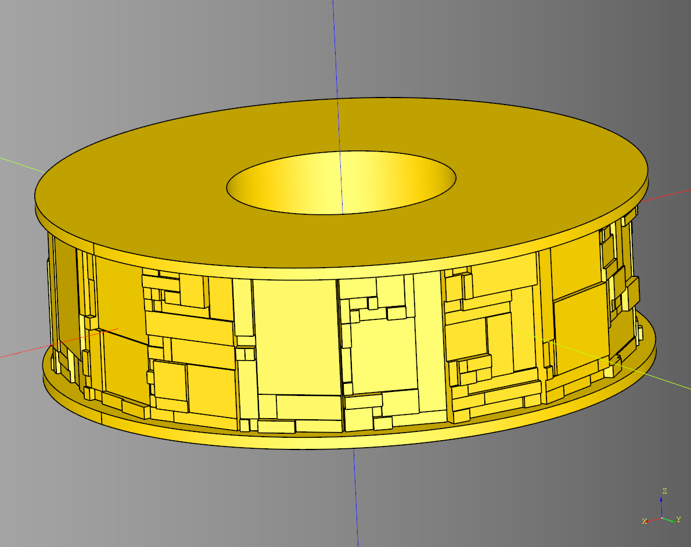

* [source](../src/cqindustry/power/SpoolCladdingGreebledUnique.py)
* [example](../example/power/spoolCladdingGreebledUnique.py)
* [stl](../stl/power_spool_cladding_greebled_panels.stl)

---

## StairLift

### parameters
* length: float
* width: float
* height: float
* overlook_tile_size: float
* walkway_tile_size: float
* tile_height: float
* face_cut_width: float
* face_cut_padding: float
* wave_function - wave.square #wave.triangle wave.sine
* wave_segment_length: float

## blueprints
* bp_stairs = Stairs

``` python
import cadquery as cq
from cqspoolterrain import StairLift
from cadqueryhelper import wave

bp_stairs = StairLift()
bp_stairs.length = 150
bp_stairs.width = 75
bp_stairs.height = 75

bp_stairs.overlook_tile_size = 10
bp_stairs.walkway_tile_size = 27
bp_stairs.tile_height = 2

bp_stairs.face_cut_width = 4
bp_stairs.face_cut_padding = 3
bp_stairs.wave_function = wave.square #wave.triangle wave.sine
bp_stairs.wave_segment_length = 5

bp_stairs.bp_stairs.render_hollow = False
bp_stairs.make()
stairs = bp_stairs.build()
show_object(stairs)
```

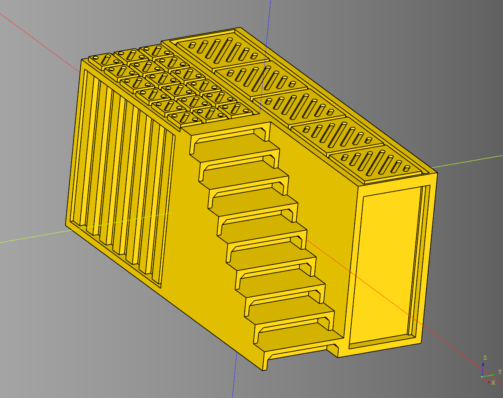

* [source](../src/cqindustry/power/StairLift.py)
* [example](../example/power/stairLift.py)
* [stl](../stl/power_stair_lift.stl)

---

## SteelFrame

### parameters
* length: float
* width: float
* height: float
* segment_length: float
* segment_width: float
* z_width: float
* z_height: float
* z_web_thickness: float
* z_flange_thickness: float
* z_join_distance: float
* y_width: float
* y_height: float
* y_web_thickness: float
* y_flange_thickness: float
* y_join_distance: float
* render_debug_outline: bool
* render_debug_grid: bool

``` python
import cadquery as cq
from cqspoolterrain import SteelFrame
    
bp_frame = SteelFrame()
bp_frame.length = 75*2
bp_frame.width = 75*1
bp_frame.height = 70
bp_frame.segment_length = 75
bp_frame.segment_width = 75
bp_frame.z_width = 5
bp_frame.z_height = 10
bp_frame.y_width = 5
bp_frame.render_debug_outline = False
bp_frame.render_debug_grid = False
bp_frame.make()
ex_frame = bp_frame.build()

show_object(ex_frame)
```

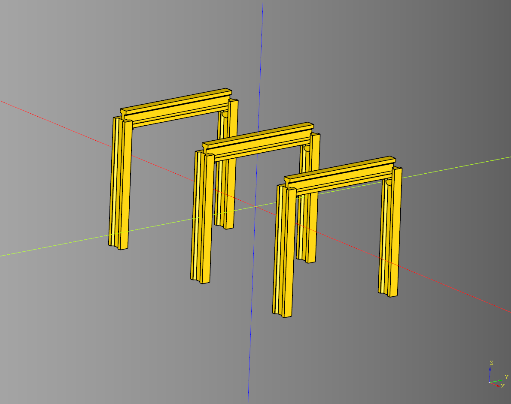

* [source](../src/cqindustry/power/SteelFrame.py)
* [example](../example/power/steelFrame.py)
* [stl](../stl/power_steel_frame.stl)

---