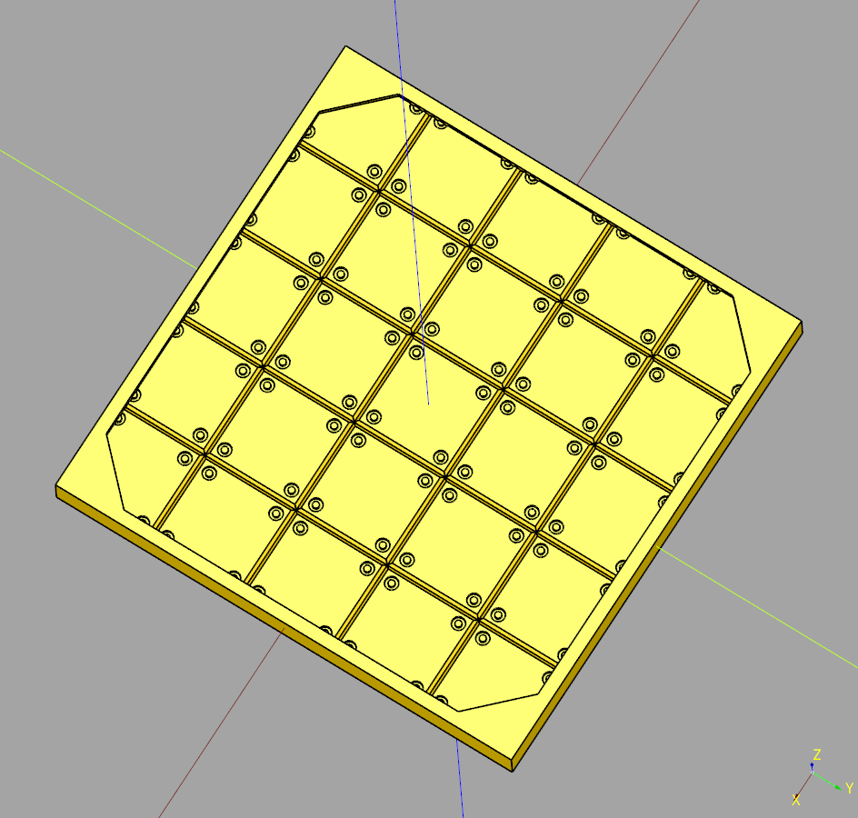

# Segment Documentation

## index

## Segment Floor

### parameters
* length: float
* width: float
* height: float
* top_padding: float

``` python
import cadquery as cq
from cqindustry.segment import SegmentFloor

bp_floor = SegmentFloor()
bp_floor.length = 75
bp_floor.width = 75
bp_floor.height = 4
bp_floor.top_padding = 1

bp_floor.make()

ex_floor = bp_floor.build()

show_object(ex_floor)
```



* [source](../src/cqindustry/segment/SegmentFloor.py)
* [example](../example/segment/segment_floor.py)
* [stl](../stl/segment_floor.stl)