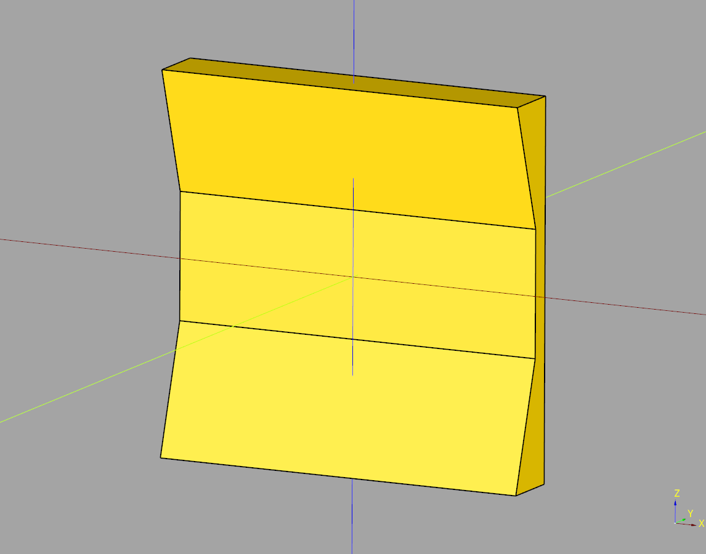
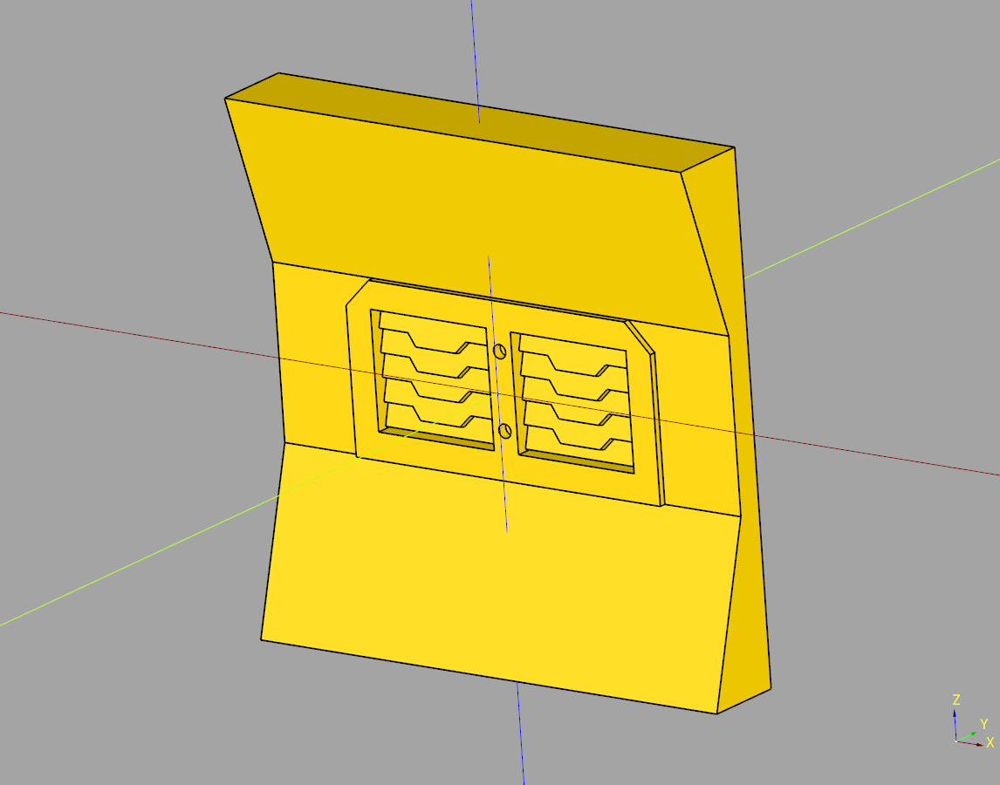

# Wall Documentation

## index
* [Corridor Wall](#corridor-wall)
* [Corridor Wall Greebled](#corridor-wall-greebled)

## Corridor Wall
Corridor wall class that inherits from cqterrain.wall BaseWall

### parameters
* length: float
* width: float
* height: float
* inner_width: float
* inner_height: float


``` python
import cadquery as cq
from cqindustry.wall import CorridorWall

bp_wall = CorridorWall()

bp_wall.length = 75
bp_wall.width = 12
bp_wall.height = 75
bp_wall.inner_width = 4
bp_wall.inner_height = 25

bp_wall.make()

ex_wall = bp_wall.build()

show_object(ex_wall)
```



* [source](../src/cqterrain/wall/CorridorWall.py)
* [example](../example/wall/corridor_wall.py)
* [stl](../stl/wall_corridor_wall.stl)

---

## Corridor Wall Greebled
Orchestrator class the combines a wall and a greeble.

### parameters
* length:float
* width:float
* height:float
* window_y_translate:float

``` python
import cadquery as cq
from cqindustry.wall import CorridorWallGreebled
from  cqterrain.window import ShutterWindow

bp_wall = CorridorWallGreebled()
bp_wall.length = 75
bp_wall.width = 12
bp_wall.height = 75
bp_wall.window_y_translate = 4

bp_window = ShutterWindow()

bp_window.length = 50
bp_window.width = 6
bp_window.height = 25

bp_window.frame_width = 4
bp_window.pane_count = 2
bp_window.louver_count = 5
bp_window.louver_rotate = 16

bp_wall.bp_window = bp_window

bp_wall.make()
ex_wall = bp_wall.build()

show_object(ex_wall)
```



* [source](../src/cqterrain/wall/CorridorWallGreebled.py)
* [example](../example/wall/corridor_wall_greebled.py)
* [stl](../stl/wall_corridor_wallgreebled.stl)